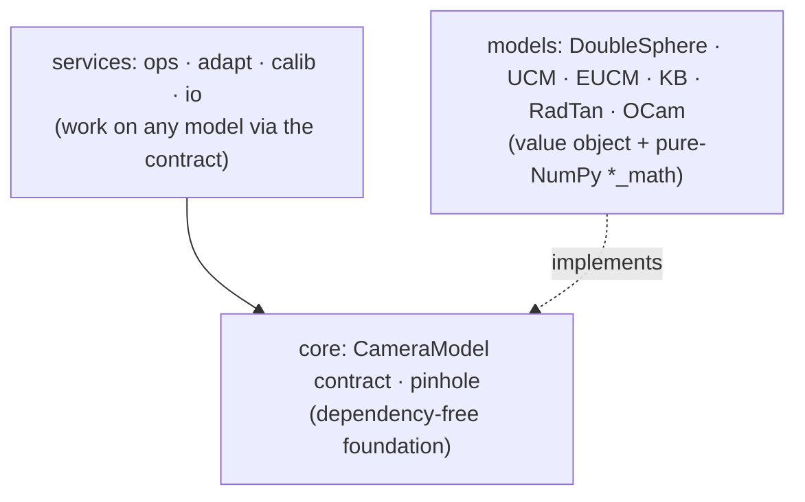

# DS-MSP — Double Sphere & Multi-Model Fisheye Camera Library

[](https://pypi.org/project/ds-msp/)
[](https://github.com/Munna-Manoj/DS-MSP/actions/workflows/ci.yml)
[](https://pypi.org/project/ds-msp/)
[](https://github.com/Munna-Manoj/DS-MSP/blob/main/LICENSE)


A clean, tested, **OpenCV-compatible** camera library for wide-FOV (fisheye) lenses, built around the
**Double Sphere** model (Usenko et al. 2018) with analytic Jacobians, calibration, model conversion, and
hardware export. It doubles as a **guided, runnable course** in wide-FOV camera geometry.


> *A real fisheye frame (left) rectified to a pinhole view (right), sweeping the `balance` knob from
> widest-FOV to tightest-crop. The bent ceiling lines and curved checkerboard straighten out.*

> **Two ways in — pick yours:**
> - 🎓 **Learn the geometry** → start the runnable curriculum in **[`docs/learn/`](https://github.com/Munna-Manoj/DS-MSP/blob/main/docs/learn/README.md)** — every chapter prints a number you can verify.
> - 🛠️ **Use the library** → [install](#install) and run the [Quick start](#quick-start) MWE below.

---

## Install

Requires **Python ≥ 3.10**.

```bash
pip install ds-msp                 # core library
pip install "ds-msp[calib]"        # + AprilGrid detector (for the calibration capstone)
```

Verify:

```bash
python -c "import ds_msp; print('DS-MSP loaded:', ds_msp.__name__)"
```

**For development** (running the examples, tests, or contributing), install from source instead:

```bash
git clone https://github.com/Munna-Manoj/DS-MSP.git
cd DS-MSP
pip install -e ".[calib]"          # editable install with the detector extra
```

> Prefer isolation? `python -m venv .venv && source .venv/bin/activate` (or `uv venv`) first.

---

## Quick start

A camera model is just two maps — **project** (3D → 2D) and **unproject** (2D → 3D) — plus a handful of
intrinsics. They are exact inverses:

```python
import numpy as np
from ds_msp import DoubleSphereCamera

# 6 intrinsics fully describe the lens (width/height are optional, only for image ops)
cam = DoubleSphereCamera(fx=711.57, fy=711.24, cx=949.18, cy=518.81, xi=0.183, alpha=0.809)

pts_3d = np.array([[0.0, 0.0, 1.0], [1.0, 1.0, 2.0]])   # camera-frame points, (N, 3)
px,   ok = cam.project(pts_3d)     # -> px:   (N, 2) pixels  + ok: (N,) validity mask
rays, ok = cam.unproject(px)       # -> rays: (N, 3) unit rays (inverse of project)

unit = pts_3d / np.linalg.norm(pts_3d, axis=1, keepdims=True)
print(np.abs(rays - unit).max())   # -> 1.7e-16  (project ∘ unproject ≈ identity)
```

That round-trip to machine precision is the whole contract: pixels and rays are interchangeable, on a
lens that sees past 180°. Every operation in the library — undistortion, PnP, calibration, two-view pose
— is built on these two maps. For the per-task recipes, see the cookbook linked below.

---

## Where to go next

Pick the door that matches what you're doing:

| Door | When you want to… | Go to |
| :-- | :-- | :-- |
| **Learn** (tutorials) | understand the geometry, step by step, on real data | [`docs/learn/`](https://github.com/Munna-Manoj/DS-MSP/blob/main/docs/learn/README.md) |
| **Cookbook** (how-to) | get one task done — undistort, PnP, convert, calibrate, export | [`docs/how-to/`](https://github.com/Munna-Manoj/DS-MSP/blob/main/docs/how-to/README.md) |
| **API reference** | look up an exact signature, argument order, return shape | [`docs/reference/`](https://github.com/Munna-Manoj/DS-MSP/blob/main/docs/reference) *(being built)* |
| **The math** (explanation) | know *why* a fisheye needs >180° geometry a pinhole can't hold | [`docs/explain/`](https://github.com/Munna-Manoj/DS-MSP/blob/main/docs/explain/README.md) |
| **Roadmap** | see what's shipped and what's coming | [`docs/ROADMAP.md`](https://github.com/Munna-Manoj/DS-MSP/blob/main/docs/ROADMAP.md) |

> The hot-loop, allocation-free projection functions and exact analytic Jacobians (`ds_project`,
> `ds_project_jacobian`) live in the [API reference](https://github.com/Munna-Manoj/DS-MSP/blob/main/docs/reference)
> *(API entries being added)*.

---

## What you get

Fisheye lenses capture a very wide field of view — often **> 180°** — by deliberately bending straight
lines. The familiar **pinhole** model can't describe that, and worse, its `X/Z` projection blows up as
rays approach 90°. DS-MSP implements the models that *can*, and does it carefully:

| | What you get |
| :-- | :-- |
| **Correct wide-FOV geometry** | Double Sphere with the exact `z > -w₂·d₁` half-space validity test — handles the full **> 180° FOV**, not the naive `z > 0` check that silently clips it. |
| **One interface, many models** | UCM, EUCM, Kannala-Brandt (= OpenCV fisheye), RadTan (= OpenCV pinhole), OCamCalib, Double Sphere — all behind a single `CameraModel` contract. |
| **Analytic Jacobians** | Exact closed-form derivatives (no autodiff, no finite differences) → faster, more robust calibration. KB & RadTan match OpenCV to ~1e-13. |
| **Model conversion** | Translate a calibration between models **without images or recalibration** (sample → unproject → LM refit). |
| **Calibration** | Generic Levenberg–Marquardt bundle adjustment for *any* model, with a robust (Cauchy) loss option. |
| **Ecosystem fluency** | Read/write **Kalibr** camchain YAML; OpenCV-style drop-in API; **TI Jacinto** LDC hardware mesh export. |
| **Verified, CI-tested** | 253-test contract suite + analytic-Jacobian gradient checks + import-linter layer checks + mypy, green on Python 3.10–3.12. |

> Why can't a pinhole just hold the whole fisheye view? A fisheye sees past 180°, and a flat plane is
> infinite at 90° — those wide rays have nowhere to land. The full geometry, with the validity test and
> FOV zones, is in **[the math: projection validity & FOV](https://github.com/Munna-Manoj/DS-MSP/blob/main/docs/explain/projection_validity_and_fov.md)**.

---

## Repository map

| Path | Contents |
| :-- | :-- |
| [`ds_msp/`](https://github.com/Munna-Manoj/DS-MSP/blob/main/ds_msp) | The library: `core/` (contracts + Lie/LM solver + robust kernels) → pure math → `models/` → services (`ops/`, `adapt/`, `io/`, `calib/`) → 3D stack (`mvg/` two-view geometry, `stereo/` depth), plus `cv.py` (OpenCV-style API) and `ldc.py` (hardware export). |
| [`examples/`](https://github.com/Munna-Manoj/DS-MSP/blob/main/examples) | Runnable demos on real data — round-trip precision, the calibration capstone, robust-loss A/B, model equivalence, stereo extrinsics, the >180° validity cone, and sphere/cylinder/pinhole reprojection. |
| [`docs/learn/`](https://github.com/Munna-Manoj/DS-MSP/blob/main/docs/learn/README.md) | The guided curriculum (start here to learn) — Part I (calibration) + Part II (geometry & 3D). |
| [`docs/`](https://github.com/Munna-Manoj/DS-MSP/blob/main/docs) | The four Diátaxis sections (`learn/`, `how-to/`, `reference/`, `explain/`), plus [`research/`](https://github.com/Munna-Manoj/DS-MSP/blob/main/docs/research) design records and [`WRITING_GUIDE.md`](https://github.com/Munna-Manoj/DS-MSP/blob/main/docs/WRITING_GUIDE.md). |
| [`tests/`](https://github.com/Munna-Manoj/DS-MSP/blob/main/tests) | Contract suite, analytic-Jacobian gradient checks, calibration, two-view geometry, stereo, manifold optimization. |

The library is **strictly layered** (enforced in CI by import-linter): `core` depends on nothing, the
service layers depend only on the contract — not on concrete models or each other — and the pure-math
modules are NumPy-only.



---

## Accuracy & verification

Correctness is asserted with **numbers**, not screenshots. The headline: the
[calibration capstone](https://github.com/Munna-Manoj/DS-MSP/blob/main/docs/learn/capstone_calibrating_a_real_camera.md)
calibrates a real fisheye from TUM-VI footage and matches the *published* intrinsics to
**0.003 % focal error** (0.08 px median reprojection).

Reproduce it locally: `pytest` runs the contract suite, and `bash verify_all.sh` runs that suite plus
the real-sample calibration and reconstruction checks. Every learn chapter prints a number you can
check. The speed and precision claims come from the benchmarks
([`benchmarks/benchmark.py`](https://github.com/Munna-Manoj/DS-MSP/blob/main/benchmarks)) — run them with:

```bash
python3 benchmarks/benchmark.py    # KB vs cv2.fisheye to ~1e-13 px; analytic Jacobian ~28× faster per LM iteration
```

---

## Credits

This project builds on excellent open-source work and research.

**Model conversion (the multi-model adapter)**
- **Fisheye-Calib-Adapter** — Sangjun Lee, *"Fisheye-Calib-Adapter: An Easy Tool for Fisheye Camera
  Model Conversion"*, arXiv:2407.12405 (2024) ·
  [github.com/eowjd0512/fisheye-calib-adapter](https://github.com/eowjd0512/fisheye-calib-adapter).
  Our conversion design (sample → unproject with the source → linear-seed → nonlinear refine on pixel
  reprojection error, per-model analytic Jacobians) and the set of supported models follow this work.

**Camera models**
- **Double Sphere** — V. Usenko, N. Demmel, D. Cremers, *"The Double Sphere Camera Model"*, 3DV 2018,
  arXiv:1807.08957. Reference: [basalt-headers](https://gitlab.com/VladyslavUsenko/basalt-headers)
  (half-space validity condition & analytic Jacobians follow it).
- **Kannala-Brandt** (equidistant) — J. Kannala, S. Brandt, 2006; cross-checked vs OpenCV `cv2.fisheye`.
- **Radial-Tangential (Brown-Conrady)** — D. C. Brown, 1966; cross-checked vs OpenCV `cv2.projectPoints`.
- **OCamCalib** — D. Scaramuzza et al. · **EUCM** — Khomutenko, Garcia, Martinet, 2016 ·
  **UCM** — Geyer & Daniilidis / Mei & Rives.

**Calibration ecosystem & tooling**
- **Kalibr** — P. Furgale et al., [github.com/ethz-asl/kalibr](https://github.com/ethz-asl/kalibr)
  (DS & EUCM contributed by V. Usenko). We follow Kalibr's `camchain` YAML format for interop.
- **[dscamera](https://github.com/matsuren/dscamera)** — Python DS utilities.
- **[Double Sphere explanation](https://jseobyun.tistory.com/455)** &
  **[projection-failed region](https://jseobyun.tistory.com/457?category=1170976)** — clear write-ups.

**This codebase**
- **Muhammadjon Boboev** — original Python Double Sphere intrinsics calibration this project grew from.

---

## License

[MIT](https://github.com/Munna-Manoj/DS-MSP/blob/main/LICENSE).
