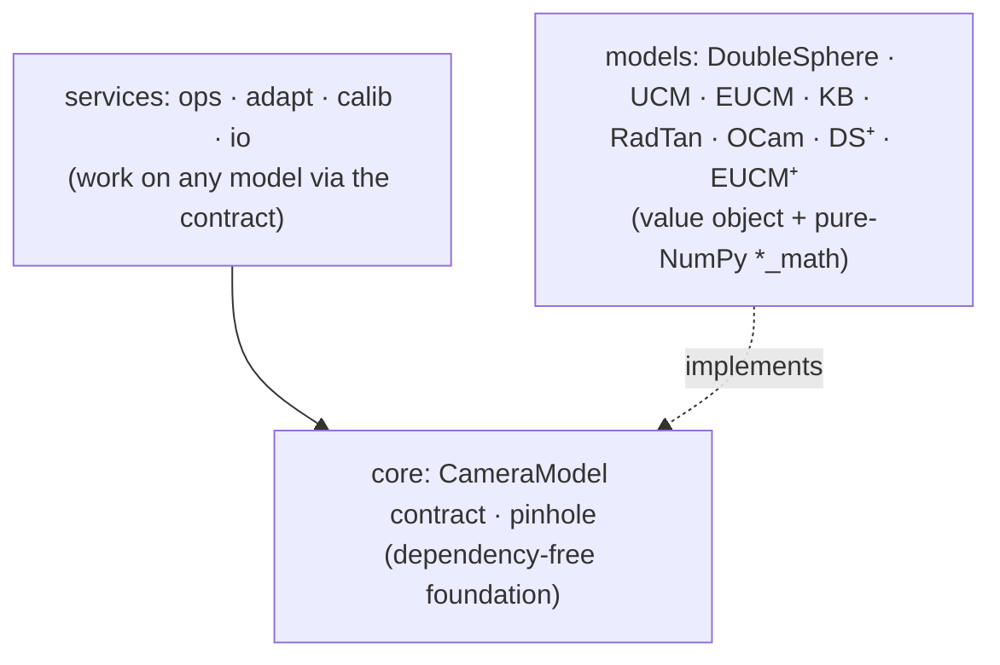

# DS-MSP — Double Sphere & Multi-model Spherical-camera Platform

[](https://pypi.org/project/ds-msp/)
[](https://github.com/Munna-Manoj/DS-MSP/actions/workflows/ci.yml)
[](https://pypi.org/project/ds-msp/)
[](https://github.com/Munna-Manoj/DS-MSP/blob/main/LICENSING.md)

[](https://munna-manoj.github.io/DS-MSP/)

A clean, tested, **OpenCV-compatible** platform for wide-FOV (fisheye / omnidirectional) cameras: a
uniform **multi-model layer** — UCM, EUCM, Kannala-Brandt, RadTan, OCamCalib, **Double Sphere**, and
the closed-form-invertible **DS⁺ / EUCM⁺** — all behind one contract, with analytic Jacobians,
**intrinsics calibration**, model conversion, **two-view & stereo 3D**, and hardware export. Built
around the **Double Sphere** model (Usenko et al. 2018). It doubles as a **guided, runnable course**
in wide-FOV camera geometry.


> *A real fisheye frame (left) rectified to a pinhole view (right), sweeping the `balance` knob from
> widest-FOV to tightest-crop. The bent ceiling lines and curved checkerboard straighten out.*

> **Two ways in — pick yours:**
> - 🎓 **Learn the geometry** → start the runnable curriculum in **[`docs/learn/`](https://github.com/Munna-Manoj/DS-MSP/blob/main/docs/learn/README.md)**.
>   Each chapter prints a number you can verify; the **[🏆 capstone](https://github.com/Munna-Manoj/DS-MSP/blob/main/docs/learn/capstone_calibrating_a_real_camera.md)**
>   calibrates a real fisheye from TUM-VI footage and matches the *published* intrinsics to **0.003 %** focal (0.08 px median).
> - 🛠️ **Use the library** → jump to **[Installation](#installation)** and **[Quick start](#quick-start)**.

---

## Table of contents

- [Why DS-MSP](#why-ds-msp)
- [See the geometry](#see-the-geometry)
- [Installation](#installation)
- [Quick start](#quick-start)
- [Repository map](#repository-map)
- [Learn: the guided curriculum](#learn-the-guided-curriculum)
- [Using the library](#using-the-library)
  - [Create a camera](#create-a-camera)
  - [Project & unproject (+ analytic Jacobian)](#project--unproject--analytic-jacobian)
  - [Undistort images](#undistort-images)
  - [Robust PnP](#robust-pnp)
  - [Multi-model support & conversion](#multi-model-support--conversion)
  - [Hardware LDC export (TI Jacinto)](#hardware-ldc-export-ti-jacinto)
- [Calibration](#calibration)
- [Deep dive: FOV, validity & undistortion](#deep-dive-fov-validity--undistortion)
- [Accuracy & verification](#accuracy--verification)
- [FAQ](#faq)
- [Roadmap](#roadmap)
- [Credits](#credits)
- [License](#license)

---

## Why DS-MSP

Fisheye lenses capture a very wide field of view — often **> 180°** — by deliberately bending straight
lines. The familiar **pinhole** model can't describe that, and worse, its `X/Z` projection blows up as
rays approach 90°. DS-MSP implements the models that *can*, and does it carefully:

| | What you get |
| :-- | :-- |
| **Correct wide-FOV geometry** | Double Sphere with the exact `z > -w₂·d₁` half-space validity test — handles the full **> 180° FOV**, not the naive `z > 0` check that silently clips it. |
| **One interface, many models** | UCM, EUCM, Kannala-Brandt (= OpenCV fisheye), RadTan (= OpenCV pinhole), OCamCalib, Double Sphere — plus closed-form **DS⁺ / EUCM⁺** for lenses DS can't fit — all behind a single `CameraModel` contract. |
| **Analytic Jacobians** | Exact closed-form derivatives (no autodiff, no finite differences) → faster, more robust calibration. KB & RadTan match OpenCV to ~1e-13. |
| **Model conversion** | Translate a calibration between models **without images or recalibration** (sample → unproject → LM refit). |
| **Calibration** | Generic Levenberg–Marquardt bundle adjustment for *any* model, with a robust (Cauchy) loss option. |
| **Ecosystem fluency** | Read/write **Kalibr** camchain YAML; OpenCV-style drop-in API; **TI Jacinto** LDC hardware mesh export. |
| **Verified, CI-tested** | 368 tests + import-linter layer checks + mypy, green on Python 3.10–3.12. |

---

## See the geometry

> 🎥 **Prefer to drive it yourself?** Open the **[live interactive studio →](https://munna-manoj.github.io/DS-MSP/)**
> — pick any of the **eight camera models** the library ships, drag a 3D point, and step its projection
> onto a **sphere, cylinder, or plane** in real time. Every pixel is computed by a TypeScript port of
> `ds_msp`, cross-checked against the library to ~10⁻¹² px. Source lives in [`web/`](web/); it stays in
> the repo but **never ships with `pip install ds-msp`**.

A camera model is a recipe for turning 3D rays into pixels. Here the **Double Sphere** model
runs on a synthetic scene — each world point is traced through its **two spheres** and projected
from the α-centre, painting the fisheye image point by point. One projection ray meets *both*
image-plane conventions at once: the model's **normalized z = 1 plane** (the virtual, upright
image the equations use) and the **physical sensor** behind both spheres (the real, inverted
image). The render's geometry is cross-checked against the library itself (`std = 2e-16`), so the
animation can't drift from the math:


The Double Sphere is radially symmetric, so a single **2-D cross-section** tells the whole story —
here the same construction with both image planes labelled (the two spheres lie between the 3-D
world and the sensor, exactly as in the paper):


And the image doesn't have to live on a flat plane. Because a fisheye is fundamentally a map
from **rays** to pixels, those rays can be stored equally on a **sphere**, a **cylinder**, or a
**pinhole** plane — and you can convert pixels between the three with exact, invertible math
(round-trips to **1e-13 px**). The sphere is the *complete* model; the flat pinhole is the
awkward special case that can't hold a >180° view. Watch one real fisheye morph through all three:


> *Verticals stay straight on the cylinder; the pinhole keeps lines straight but balloons the
> periphery and drops the polar cone to black — the >180° geometry has nowhere to land on a plane.*

**Is the conversion math actually correct?** The bundled fisheye has a checkerboard with 30 known
corner pixels. We push each corner through the math — `raw pixel → unproject → ray → chart pixel`
— and overlay it on every representation. Every corner lands **exactly** on its checkerboard
intersection in all four images, and round-trips back to its raw pixel to **7e-14 px**:

| Raw fisheye | Pinhole (gnomonic) |
| :---: | :---: |
|  |  |
| **Sphere (equirectangular)** | **Cylinder** |
|  |  |

> The board bows on the sphere, straightens on the pinhole, keeps verticals straight on the
> cylinder — yet no corner ever leaves the checkerboard. Full derivation, the pixel↔pixel
> formulas, and the per-representation round-trip table:
> **[sphere/cylinder/pinhole deep-dive](https://github.com/Munna-Manoj/DS-MSP/blob/main/docs/learn/spherical_and_cylindrical_reprojection.md)**
> (`examples/08`). Every figure is generated by a checked-in script that cross-checks its frames against the library's own geometry.

---

## Installation

Requires **Python ≥ 3.10**.

```bash
pip install ds-msp                 # core library
pip install "ds-msp[calib]"        # + AprilGrid detector (for the calibration capstone)
```

Verify:

```bash
python -c "import ds_msp; print('DS-MSP loaded:', ds_msp.__name__)"
```

**For development** (running the examples, tests, or contributing), install from source instead:

```bash
git clone https://github.com/Munna-Manoj/DS-MSP.git
cd DS-MSP
pip install -e ".[calib]"          # editable install with the detector extra
```

> Prefer isolation? `python -m venv .venv && source .venv/bin/activate` (or `uv venv`) first.

---

## Quick start

A camera model is just two maps — **project** (3D → 2D) and **unproject** (2D → 3D) — plus a handful of
intrinsics. They are exact inverses:

```python
import numpy as np
from ds_msp import DoubleSphereCamera

# 6 intrinsics fully describe the lens (width/height are optional, only for image ops)
cam = DoubleSphereCamera(fx=711.57, fy=711.24, cx=949.18, cy=518.81, xi=0.183, alpha=0.809)

pts_3d = np.array([[0.0, 0.0, 1.0], [1.0, 1.0, 2.0]])   # camera-frame points (N, 3)
px,   ok = cam.project(pts_3d)     # -> (N, 2) pixels + (N,) validity mask
rays, ok = cam.unproject(px)       # -> (N, 3) unit rays  (inverse of project)
```

**Want to see it on real data?** With the `[calib]` extra and the TUM-VI download
(`bash scripts/download_datasets.sh tumvi`), calibrate a real fisheye from scratch and match the
published reference:

```bash
python examples/03_calibrate_tumvi_aprilgrid.py
```

---

## Repository map

| Path | Contents |
| :-- | :-- |
| [`ds_msp/`](ds_msp) | The library: `core/` (contracts + Lie/LM solver + robust kernels) → pure math → `models/` → services (`ops/`, `adapt/`, `io/`, `calib/`) → 3D stack (`mvg/` two-view geometry, `stereo/` depth), plus `cv.py` (OpenCV-style API) and `ldc.py` (hardware export). |
| [`examples/`](examples) | Eight runnable demos on real data (`01`–`08`) — round-trip precision, the calibration capstone, robust-loss A/B, model equivalence, stereo extrinsics, the >180° validity cone, and sphere/cylinder/pinhole reprojection. *(Part II / Tier-1 demos landing — see [ROADMAP](https://github.com/Munna-Manoj/DS-MSP/blob/main/docs/ROADMAP.md).)* |
| [`docs/learn/`](https://github.com/Munna-Manoj/DS-MSP/blob/main/docs/learn/README.md) | The guided curriculum (start here to learn) — Part I (calibration) + Part II (geometry & 3D). |
| [`docs/`](docs) | [`MULTI_MODEL.md`](https://github.com/Munna-Manoj/DS-MSP/blob/main/docs/MULTI_MODEL.md) (multi-model + conversion guide), [`ROADMAP.md`](https://github.com/Munna-Manoj/DS-MSP/blob/main/docs/ROADMAP.md), [`WRITING_GUIDE.md`](https://github.com/Munna-Manoj/DS-MSP/blob/main/docs/WRITING_GUIDE.md) (docs style guide). |
| [`datasets/`](datasets/README.md) | Data guide: what to download, where it goes, how to start. |
| [`tests/`](tests) | 368 tests (contract suite, analytic-Jacobian gradient checks, calibration, two-view geometry, stereo, manifold optimization). |

The library is **strictly layered** (enforced in CI by import-linter): `core` depends on nothing, the
service layers depend only on the contract — not on concrete models or each other — and the pure-math
modules are NumPy-only.



*(Full diagram and design guarantees in [`docs/MULTI_MODEL.md`](https://github.com/Munna-Manoj/DS-MSP/blob/main/docs/MULTI_MODEL.md#6-architecture--design-guarantees).)*

---

## Learn: the guided curriculum

If you want to *understand* wide-FOV geometry (not just call it), the **[`docs/learn/`](https://github.com/Munna-Manoj/DS-MSP/blob/main/docs/learn/README.md)**
track teaches it on real public data — every chapter prints a number you can verify. It runs in
two arcs: **Part I — Calibration** (take one camera to a published-grade calibration) and
**Part II — Geometry & 3D** (take that camera out into the world: two-view pose, manifold
optimization, stereo depth).

**Part I — Calibration**

| # | Lesson | You'll be able to… |
| :-- | :-- | :-- |
| 1 | [Fisheye & camera models](https://github.com/Munna-Manoj/DS-MSP/blob/main/docs/learn/01_fisheye_and_camera_models.md) | load a published calibration, prove project/unproject invert to ~1e-14 px, rectify a real frame |
| 2 | [The Double Sphere model](https://github.com/Munna-Manoj/DS-MSP/blob/main/docs/learn/02_double_sphere_model.md) | derive DS from first principles and read it in code |
| 🏆 | [**Capstone: calibrate a real camera**](https://github.com/Munna-Manoj/DS-MSP/blob/main/docs/learn/capstone_calibrating_a_real_camera.md) | detect AprilGrid corners (multi-scale, periphery-robust), bundle-adjust, and **match TUM-VI's published intrinsics to 0.003 %** focal |
| 🔬 | [Detecting every AprilGrid tag (fisheye periphery)](https://github.com/Munna-Manoj/DS-MSP/blob/main/docs/learn/robust_aprilgrid_detection.md) | why an off-centre board drops to 4/36 tags, and the multi-scale + recovery fix (focal 0.7%→0.003%) |
| 🔬 | [Robust losses & evaluation](https://github.com/Munna-Manoj/DS-MSP/blob/main/docs/learn/robust_losses_and_evaluation.md) | handle outliers without discarding data; why median/inlier RMS beat naive RMS |
| 🔬 | [Are two models the same camera?](https://github.com/Munna-Manoj/DS-MSP/blob/main/docs/learn/are_two_models_the_same_camera.md) | prove DS `fx≈152` and KB `fx≈191` describe the same lens |
| 🔬 | [Sphere, cylinder & pinhole reprojection](https://github.com/Munna-Manoj/DS-MSP/blob/main/docs/learn/spherical_and_cylindrical_reprojection.md) | move one fisheye between a sphere, cylinder, and pinhole image — exact pixel maps, verified to 1e-13 px |

**Part II — Geometry & 3D** — *the wide-FOV SLAM/SfM stack. Library shipped & tested
(`ds_msp/mvg/`, `ds_msp/core/`, `ds_msp/stereo/`); chapters + runnable examples landing now —
see [`docs/learn/`](https://github.com/Munna-Manoj/DS-MSP/blob/main/docs/learn/README.md) and the [ROADMAP](https://github.com/Munna-Manoj/DS-MSP/blob/main/docs/ROADMAP.md).* Two-view geometry on bearing vectors, manifold (SO(3)/SE(3))
pose optimization with an in-house LM solver, Schur-complement bundle adjustment, and sphere-sweep
stereo depth straight on raw fisheye.

---

## Using the library

> Full multi-model cookbook (every operation, on every model) lives in
> **[`docs/MULTI_MODEL.md`](https://github.com/Munna-Manoj/DS-MSP/blob/main/docs/MULTI_MODEL.md)**. The essentials:

### Create a camera

The model needs **only the 6 intrinsics** for projection / unprojection / PnP. `width` and `height` are
optional — required *only* by image-level helpers (which raise a clear error if missing).

```python
from ds_msp import DoubleSphereCamera

# (a) math-only — no meaningless image dimensions required
cam = DoubleSphereCamera(fx=711.57, fy=711.24, cx=949.18, cy=518.81, xi=0.183, alpha=0.809)

# (b) with dimensions, for image undistortion
cam = DoubleSphereCamera(711.57, 711.24, 949.18, 518.81, 0.183, 0.809, width=1920, height=1080)

# (c) from a calibration result
cam = DoubleSphereCamera.from_json("results/calibration_params.json")

K, D = cam.K, cam.D    # 3×3 intrinsic matrix and [xi, alpha]
```

> `alpha` is validated to `[0, 1]` at construction; keep `xi` in `[-1, 1]` for the well-posed domain.

### Project & unproject (+ analytic Jacobian)

```python
import numpy as np
pts_3d = np.array([[0, 0, 1], [1, 1, 2]], dtype=np.float64)

px,   valid = cam.project(pts_3d)    # (N,2) pixels + validity (correct half-space test)
rays, valid = cam.unproject(px)      # (N,3) unit rays + validity

# Hot loops: allocation-free standalone functions + exact derivatives
from ds_msp import ds_project
from ds_msp.model import ds_project_jacobian

u, v, valid = ds_project(pts_3d, cam.fx, cam.fy, cam.cx, cam.cy, cam.xi, cam.alpha)
# J_point = d(u,v)/d(x,y,z),  J_intr = d(u,v)/d(fx,fy,cx,cy,xi,alpha)
u, v, J_point, J_intr, valid = ds_project_jacobian(
    pts_3d, cam.fx, cam.fy, cam.cx, cam.cy, cam.xi, cam.alpha)
```

### Undistort images

Drop-in OpenCV-style API (`ds_msp.cv` mirrors `cv2.fisheye`):

```python
import cv2, ds_msp.cv as ds_cv

img = cv2.imread("assets/test_image.jpg")
K, D = cam.K, cam.D

# balance=0.0 -> widest FOV (more scene, black borders); balance=1.0 -> tightest crop
K_new = ds_cv.estimateNewCameraMatrixForUndistortRectify(K, D, (1920, 1080), balance=0.0)
img_undist = ds_cv.undistortImage(img, K, D, Knew=K_new)
```

The object API is equivalent: `img_undist, K_new = cam.undistort_image(img)`.

### Robust PnP

Standard PnP assumes a pinhole model and fails on raw fisheye points. The DS solver unprojects to rays
first, keeps the front-facing valid rays, then solves:

```python
success, rvec, tvec = cam.solve_pnp(points_3d, points_2d)          # object API
success, rvec, tvec = ds_cv.solvePnP(points_3d, points_2d, cam.K, cam.D)   # OpenCV-style
```

### Multi-model support & conversion

Calibrate in one model and translate to another **without images or recalibration**:

```python
import json
from ds_msp import DoubleSphereModel, KannalaBrandtModel, convert, Undistorter, solve_pnp

ds = DoubleSphereModel.from_dict(json.load(open("results/calibration_params.json")))

kb, report = convert(ds, KannalaBrandtModel, width=1920, height=1080)   # DS -> OpenCV fisheye
print(report["rms_px"])            # sub-pixel agreement across the image

# every feature works on any model — swapping models is a one-line change
solve_pnp(kb, object_points, image_points)
img_rect, K_new = Undistorter(kb, 1920, 1080).undistort_image(img)
```

Supported: **UCM, EUCM, Kannala-Brandt, RadTan, OCamCalib, Double Sphere**, plus the two
closed-form-invertible extensions **DS⁺** and **EUCM⁺** (below) — all with analytic
Jacobians. You can also calibrate any model (`ds_msp.calib.calibrate`) and read/write **Kalibr YAML**
(`ds_msp.io`). Conversion design follows
[Fisheye-Calib-Adapter](https://github.com/eowjd0512/fisheye-calib-adapter) (see [Credits](#credits)).

### DS⁺ / EUCM⁺ — closed-form models for lenses that defeat Double Sphere

Two spherical models with **extra invertible distortion stages** for lenses whose radial curve
falls *outside* the rigid 2-DOF Double-Sphere manifold (see the FOV note below):

- **DS⁺** = UCM core + 2-term Fitzgibbon division (θ³, θ⁵) + 2-axis Scheimpflug tilt. 9 params.
  Closed-form inverse (one cube root). Most accurate and the most robust to seed; our default when
  accuracy matters most.
- **EUCM⁺** = EUCM core (`α, β`) + 1-term division + 2-axis tilt. 9 params. **Truly closed-form,
  square-root-only** inverse — no cube root, no Newton iteration — so it round-trips to ~1e-9° and
  unprojects in DS-class cycles.

```python
from ds_msp.models import DSPlusModel, EUCMPlusModel          # or model_class("dsplus")/("eucm+")
cam = EUCMPlusModel.from_dict(json.load(open("eucm_plus_parameters.json")))
```

Both register by name (`dsplus`, `eucmplus`, aliases `ds+`/`eucm+`), satisfy the full `CameraModel`
contract (project / unproject / analytic Jacobian / convert / Kalibr+MC-Calib I/O), and reduce
exactly to their parent (`DS⁺→UCM`, `EUCM⁺→EUCM`) when the extra DOF are zero.

### Choosing a model by FOV (from experience)

A practical finding from calibrating real lenses across the range: **the spherical family
(UCM / EUCM / Double Sphere) can quietly *collapse* on smaller wide-angle lenses (~120–140°) yet
fit cleanly on very wide ones (170–195°).** On a ~140° checkerboard lens here, Double Sphere drove
`ξ→0` (one sphere goes dead) and floored at ~2–3 px; on 170° and 195° lenses the same model dropped
to the detection limit (~0.08–0.6 px) with no trouble. The reason is geometric, not a bug: a
moderate-FOV lens whose radial curve needs a θ⁵ term plus a little decentering sits *outside* DS's
2-DOF curve, while a true ultra-wide lens bends enough that the two-sphere shape matches it. So
"more distortion" is actually *easier* for the sphere models — counterintuitive but consistent.

What we reach for, by FOV band (✅ recommended · ⚠️ works with care · ❌ avoid):

| Model | ~120–140° (small wide) | 170–195° (ultra wide) | Notes from use |
| :-- | :--: | :--: | :-- |
| **RadTan** (OpenCV pinhole) | ⚠️ | ❌ | Fine for mild distortion; the `X/Z` projection blows up approaching 180° — not a fisheye model. |
| **KB** (OpenCV fisheye) | ✅ | ✅ | The dependable conventional baseline at every band (~0.35 px @140°, detection-limited beyond). Iterative (Newton) unproject. |
| **UCM / EUCM / Double Sphere** | ❌ (collapse risk) | ✅ | Closed-form & cheap, but can degenerate at ~140° (`ξ`/`α` collapse). Excellent once the lens is genuinely ultra-wide. |
| **DS⁺** | ✅ (best accuracy) | ✅ | Restores the missing DOF; most accurate (~0.21 px @140°) and converges from a plain seed at any FOV. Inverse uses one cube root. |
| **EUCM⁺** | ✅ | ✅ | Truly sqrt-only closed form; ~0.29 px @140°. At ~140° seed it multi-start; at 170–195° a single seed suffices. |

> **Rule of thumb:** ultra-wide (≥170°) → start with **Double Sphere** (cheapest closed form that
> fits). Smaller wide-angle (~120–150°) → if DS/EUCM collapse, move to **KB** (conventional) or, for
> a closed-form inverse, **DS⁺ / EUCM⁺**. Always confirm with the median reprojection error rather
> than trusting the model class.
>
> *Numbers above are from this repo's datasets (a ~140° checkerboard lens, a 170° `anns` lens, and a
> 195° TUM-VI lens); treat them as directional guidance, not guarantees for your optics.*

### Hardware LDC export (TI Jacinto)

Generate a displacement-mesh LUT for the on-chip Lens Distortion Correction engine (J7 / TDA4):

```python
from ds_msp.ldc import TI_LDC_MeshGenerator

gen = TI_LDC_MeshGenerator(cam)                  # cam built with width/height
res = gen.generate_mesh_and_intrinsics(1920, 1080, downsample_factor=4, balance=0.5)
mesh_lut, K_new = res["mesh_lut"], res["K_new"]  # int16 Q3 displacements + rectified intrinsics
```

> **Best practice:** use the LDC image for the picture, but undistort *keypoints* with the closed-form
> `cam.undistort_points(pts, K_new)` at the **same `balance`**. The mesh point-inverse is exact at the
> center but diverges toward the periphery; sharing `K_new` keeps the two consistent to ~0.1 px.

---

## Calibration

Calibrate the **intrinsics of any model** from your own images: detect corners with OpenCV, hand the
3D↔2D correspondences to the generic backend, done. `ds_msp.calib.calibrate` is **model-agnostic** —
the *same call* fits DS, UCM, EUCM, KB, RadTan, OCam, DS⁺ or EUCM⁺; only the seed class changes. It
runs a manifold Levenberg–Marquardt solve with **analytic Jacobians** and an optional **robust loss**,
so a few mis-detected corners down-weight instead of dragging the fit.

### From a checkerboard with OpenCV (the common case)

```python
import cv2, glob, numpy as np
from ds_msp.calib import calibrate
from ds_msp.models import KannalaBrandtModel       # swap for DoubleSphereModel, EUCMModel, DSPlusModel, …

# board geometry: the inner-corner grid of your printed checkerboard, in metres
COLS, ROWS, SQUARE = 9, 6, 0.025
objp = np.zeros((ROWS * COLS, 3), np.float64)
objp[:, :2] = np.mgrid[0:COLS, 0:ROWS].T.reshape(-1, 2) * SQUARE

# 1. detect corners with OpenCV in every calibration frame
X_world, keypoints, visibility, shape = [], [], [], None
for path in sorted(glob.glob("calib_images/*.png")):
    gray = cv2.imread(path, cv2.IMREAD_GRAYSCALE)
    shape = gray.shape
    found, corners = cv2.findChessboardCornersSB(gray, (COLS, ROWS), cv2.CALIB_CB_EXHAUSTIVE)
    if not found:
        continue                                    # SB detector is sub-pixel by design
    X_world.append(objp.copy())
    keypoints.append(corners.reshape(-1, 2).astype(np.float64))
    visibility.append(np.ones(len(objp), bool))     # all corners seen (partial boards are fine too)

# 2. calibrate ANY model from a generic seed (cx,cy = image centre; a rough focal is fine —
#    per-view poses are re-seeded internally). loss="huber" down-weights stray corners.
h, w = shape
seed = KannalaBrandtModel(fx=0.5 * w, fy=0.5 * w, cx=0.5 * w, cy=0.5 * h)
result = calibrate(seed, X_world, keypoints, visibility, loss="huber", f_scale=1.0)

print(result["model"])                              # calibrated intrinsics
print("reprojection RMS:", result["rms_px"], "px")  # quality check
result["model"].to_dict()                           # JSON-ready (or convert(...) to another model)
```

That's the whole loop — OpenCV finds the corners, the backend fits the model. To try a different
model, change only the `seed` class (see [Choosing a model by FOV](#choosing-a-model-by-fov-from-experience)
for which fits your lens); to switch the calibrated result to another model afterwards, use
[`convert`](#multi-model-support--conversion) — no re-detection needed.

### From an AprilGrid (robust across the fisheye periphery)

For wide fisheye lenses an AprilGrid keeps corners detectable out to the rim. This is what the
[capstone](https://github.com/Munna-Manoj/DS-MSP/blob/main/docs/learn/capstone_calibrating_a_real_camera.md) uses on real TUM-VI footage:

```python
import glob
from ds_msp.calib import calibrate, AprilGridTarget, detect_aprilgrid
from ds_msp.models import KannalaBrandtModel

# 1. detect AprilGrid corners in your calibration frames
frames = sorted(glob.glob("datasets/tumvi/dataset-calib-cam1_512_16/mav0/cam0/data/*.png"))
detections = detect_aprilgrid(frames, family="t36h11")

# 2. turn tag detections into 3D<->2D correspondences (board geometry: 6x6, 88 mm, spacing 0.3)
target = AprilGridTarget(tag_rows=6, tag_cols=6, tag_size=0.088, tag_spacing=0.3)
X_world, keypoints, visibility = target.build_correspondences(detections)

# 3. bundle-adjust from a generic seed (analytic Jacobian + robust Cauchy loss)
seed = KannalaBrandtModel(fx=180, fy=180, cx=256, cy=256)
result = calibrate(seed, X_world, keypoints, visibility, loss="cauchy", f_scale=0.5)
print(result["rms_px"])      # sub-pixel; the capstone reports 0.08 px median, matching the published calibration
```

See the full walk-through in the **[calibration capstone](https://github.com/Munna-Manoj/DS-MSP/blob/main/docs/learn/capstone_calibrating_a_real_camera.md)**.

### The bundled Double Sphere script

A ready-to-run script calibrates Double Sphere from COCO-style checkerboard annotations:

```bash
python calibrate.py        # reads anns.json -> writes results/calibration_params.json
python validate.py         # visual reprojection check -> results/visualizations/
```

On the bundled data this converges to `fx≈711.6, fy≈711.2, cx≈949.2, cy≈518.8, xi≈0.183, alpha≈0.809`
at **0.64 px** RMS.

> **Parameter domain (important).** The optimizer constrains distortion to the *well-posed* Double
> Sphere range `α ∈ [0, 1]`, `ξ ∈ [-1, 1]` (matching basalt/Kalibr). Outside it the model becomes
> non-injective (projection folds back, so unprojection can't invert it); real fisheye lenses sit
> roughly in `ξ ∈ [-0.2, 0.6]`.

---

## Deep dive: FOV, validity & undistortion

*A common question: "Why are pixels missing from my undistorted image, even when I try to keep the whole image?"*

### Undistortion modes

Verified on real data (`assets/test_image.jpg`, `assets/test_image_96.jpg`):

| Distorted | Undistorted (crop) | Undistorted (whole) | Undistorted (zoom) |
| :---: | :---: | :---: | :---: |
|  |  |  |  |
|  |  |  |  |

- **Crop (`balance=1.0`)** — keeps only center-valid pixels: no black borders, less FOV.
- **Whole (`balance=0.0`)** — keeps all pixels that map to the plane: full content, black borders.
- **Zoom (reduced focal)** — captures even more wide-angle content, shrinking the center.

### Projection validity — the correct condition

The Double Sphere projection `π(x)` is **not** valid for all 3D points. The exact projectability test
(Usenko et al. 2018, Eq. 43–45), implemented in `ds_project`, is the half-space condition:

$$z > -w_2\, d_1, \qquad d_1 = \sqrt{x^2 + y^2 + z^2}$$

with the two helper terms

$$
w_1 =
\begin{cases}
\dfrac{\alpha}{1-\alpha} & \text{if } \alpha \le 0.5 \\
\dfrac{1-\alpha}{\alpha} & \text{if } \alpha > 0.5
\end{cases}
$$

$$
w_2 = \frac{w_1 + \xi}{\sqrt{2\, w_1 \xi + \xi^2 + 1}}
$$

This admits points with **`z ≤ 0`** (rays beyond 90°), which is exactly why the model supports a
**> 180° FOV**. A naive `z > 0` test — a common implementation mistake — rejects those rays and
silently caps the FOV below 180°; this library does **not** make that mistake.

<details>
<summary><b>Forward / inverse equations (for reference)</b></summary>

$$d_2 = \sqrt{x^2 + y^2 + (\xi d_1 + z)^2}, \qquad
\begin{bmatrix} u \\ v \end{bmatrix} =
\begin{bmatrix} f_x\, x / \big(\alpha d_2 + (1-\alpha)(\xi d_1 + z)\big) + c_x \\
f_y\, y / \big(\alpha d_2 + (1-\alpha)(\xi d_1 + z)\big) + c_y \end{bmatrix}$$

Unprojection is closed-form; with $m_x=(u-c_x)/f_x$, $m_y=(v-c_y)/f_y$, $r^2=m_x^2+m_y^2$ it is valid
for all $r^2$ when $\alpha \le 0.5$, and for $r^2 \le 1/(2\alpha-1)$ when $\alpha > 0.5$.

**Valid parameter domain:** $\alpha \in [0, 1]$, $\xi \in [-1, 1]$.

</details>

### The FOV zones


- **Green (frontal, `θ < 90°`)** — safe for standard pinhole projection.
- **Yellow (side/back, `90° ≤ θ < θ_limit`)** — valid in DS, but impossible to project into a single
  pinhole image (`Z ≤ 0`): a pinhole plane is infinite at 90°, so these pixels have nowhere to go.
- **Red (`θ ≥ θ_limit`)** — mathematically invalid in DS.
- **White stars** — real keypoints, all safely inside the valid regions.

This is why undistortion can't keep a full > 180° FOV: those wide-angle pixels are not lost to a bug,
they are geometrically un-pinhole-able. *(Reference: [projection-failed region analysis](https://jseobyun.tistory.com/457?category=1170976).)*

---

## Accuracy & verification

Correctness is asserted with **numbers**, not screenshots (`tests/`, `verify_real_samples.py`):

| Check | Result |
| :-- | :-- |
| Inverse projection `K⁻¹` (all undistortion modes) | mean error **< 0.00003 px** ✅ |
| 3D reconstruction of checkerboard corners | mean position error **1.168 mm**; recovered square **20.01 cm** (target 20.00) ✅ |
| PnP + reprojection RMS (real `test_image` / `_96`) | **0.43 px** / **0.85 px** |
| Undistort: object API vs `cv.py` wrapper | identical |
| KB / RadTan vs OpenCV | match to **~1e-13** |

**Conclusion:** the undistorted images are geometrically accurate pinhole projections suitable for
precise 3D vision. Reproduce locally with `bash verify_all.sh` or `pytest`; for the accuracy/speed
numbers above, run **[`python benchmarks/benchmark.py`](benchmarks/)** (e.g. KB vs `cv2.fisheye` to
~1e-13 px; analytic Jacobian ~28× faster per LM iteration than finite differences).

---

## FAQ

**My undistorted image has black borders?**
Normal for fisheye — a pinhole view can't capture the full > 180° FOV. Tune `balance` in
`estimateNewCameraMatrixForUndistortRectify` to trade border vs FOV.

**PnP fails or gives bad results?**
Use `cam.solve_pnp(...)` (or `ds_msp.cv.solvePnP`), not `cv2.solvePnP` — the latter assumes pinhole and
fails on raw fisheye points. You need ≥ 4 points that are in front of the camera after unprojection.

**What ranges are valid for `xi` and `alpha`?**
`alpha ∈ [0, 1]` (enforced at construction) and `xi ∈ [-1, 1]`. Beyond that the model is non-injective;
the calibrator constrains to this domain automatically. Real lenses sit in `xi ∈ [-0.2, 0.6]`.

**Do I have to pass `width` and `height`?**
No — only for image-level operations (undistortion maps / `compute_K_new`). Projection, unprojection,
Jacobians, and PnP need just the 6 intrinsics.

**How do I use this with ROS?**
Wrap `ds_msp.cv.undistortImage` in a node: subscribe to `image_raw`, undistort, publish `image_rect`.

---

## Roadmap

DS-MSP is actively growing from a camera library into a small perception toolkit (multi-camera &
camera-IMU calibration, visual odometry on public benchmarks, a C++/Ceres core, inference-only learned
3D). See **[`docs/ROADMAP.md`](https://github.com/Munna-Manoj/DS-MSP/blob/main/docs/ROADMAP.md)** for the build order and design rules.

---

## Credits

This project builds on excellent open-source work and research.

**Model conversion (the multi-model adapter)**
- **Fisheye-Calib-Adapter** — Sangjun Lee, *"Fisheye-Calib-Adapter: An Easy Tool for Fisheye Camera
  Model Conversion"*, arXiv:2407.12405 (2024) ·
  [github.com/eowjd0512/fisheye-calib-adapter](https://github.com/eowjd0512/fisheye-calib-adapter).
  Our conversion design (sample → unproject with the source → linear-seed → nonlinear refine on pixel
  reprojection error, per-model analytic Jacobians) and the set of supported models follow this work.

**Camera models**
- **Double Sphere** — V. Usenko, N. Demmel, D. Cremers, *"The Double Sphere Camera Model"*, 3DV 2018,
  arXiv:1807.08957. Reference: [basalt-headers](https://gitlab.com/VladyslavUsenko/basalt-headers)
  (half-space validity condition & analytic Jacobians follow it).
- **Kannala-Brandt** (equidistant) — J. Kannala, S. Brandt, 2006; cross-checked vs OpenCV `cv2.fisheye`.
- **Radial-Tangential (Brown-Conrady)** — D. C. Brown, 1966; cross-checked vs OpenCV `cv2.projectPoints`.
- **OCamCalib** — D. Scaramuzza et al. · **EUCM** — Khomutenko, Garcia, Martinet, 2016 ·
  **UCM** — Geyer & Daniilidis / Mei & Rives.

**Calibration ecosystem & tooling**
- **Kalibr** — P. Furgale et al., [github.com/ethz-asl/kalibr](https://github.com/ethz-asl/kalibr)
  (DS & EUCM contributed by V. Usenko). We follow Kalibr's `camchain` YAML format for interop.
- **[dscamera](https://github.com/matsuren/dscamera)** — Python DS utilities.
- **[Double Sphere explanation](https://jseobyun.tistory.com/455)** &
  **[projection-failed region](https://jseobyun.tistory.com/457?category=1170976)** — clear write-ups.

**This codebase**
- **Muhammadjon Boboev** — original Python Double Sphere intrinsics calibration this project grew from.

---

## License

**Dual-licensed** (see [LICENSING.md](LICENSING.md)):

- The library is **[MIT](LICENSE)** — free for any use, including commercial.
- The **DS+** and **EUCM+** model implementations (`ds_msp/models/{dsplus,eucmplus}*.py`)
  are **[PolyForm Noncommercial 1.0.0](LICENSE-NONCOMMERCIAL.txt)** — free for research,
  academic, personal and other noncommercial use **with attribution to Munna-Manoj**;
  commercial use of DS+/EUCM+ requires a separate license from the author.

SPDX: `MIT AND LicenseRef-PolyForm-Noncommercial-1.0.0`. Please cite via [CITATION.cff](CITATION.cff).
