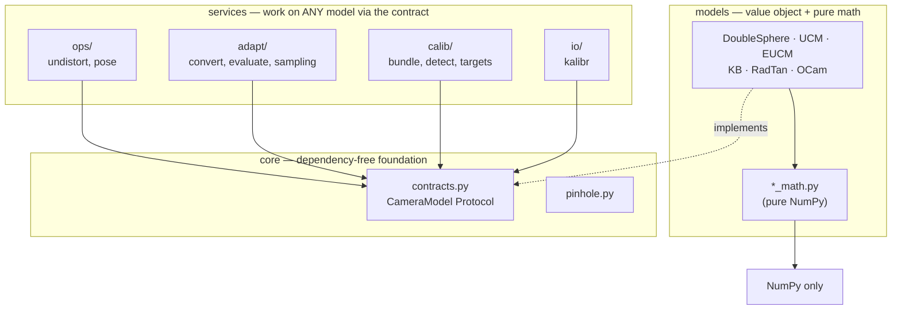

# Multi-Model Camera Library & Model Conversion

DS-MSP is not only a Double Sphere implementation — it is a small, uniform
multi-model camera library. You can **calibrate in one model and convert the
parameters to any other**, then run **every feature** (project, unproject,
undistort, PnP, calibrate, Kalibr I/O) on any model interchangeably.

This capability is directly inspired by **Fisheye-Calib-Adapter** (Sangjun Lee,
2024); see [Credits](#credits). Everything here is pure Python (NumPy/SciPy/OpenCV)
with **analytic Jacobians** — no autodiff.

---

## 1. Supported models

All models implement the same `CameraModel` contract (`project`, `unproject`,
`project_jacobian`, serialization). Each ships pure math (`*_math.py`) plus a thin
value-object class.

| Model | Class | Params | Notes |
| :--- | :--- | :--- | :--- |
| Double Sphere | `DoubleSphereModel` | `fx, fy, cx, cy, xi, alpha` | wide FOV, closed-form unprojection |
| UCM | `UCMModel` | `fx, fy, cx, cy, alpha` | unified (single sphere) = DS with ξ=0 |
| EUCM | `EUCMModel` | `fx, fy, cx, cy, alpha, beta` | enhanced UCM |
| Kannala-Brandt | `KannalaBrandtModel` | `fx, fy, cx, cy, k1..k4` | **= OpenCV `cv2.fisheye`** |
| RadTan / pinhole | `RadTanModel` | `fx, fy, cx, cy, k1, k2, p1, p2, k3` | **= OpenCV `cv2.projectPoints`** (narrow FOV) |
| OCamCalib | `OCamModel` | `cx, cy, c, d, e, a0..a4` | Scaramuzza polynomial |
| (test stand-in) | `ds_msp.testing.FakeModel` | `fx, fy, cx, cy` | perfect pinhole, no fisheye math |

KB project matches `cv2.fisheye` and RadTan matches `cv2.projectPoints` to ~1e-13.
Every model's analytic Jacobian is gradient-checked against finite differences.

### How each model's 2D↔3D geometry works

All models share the same idea: **project** maps a 3D camera-frame point to a pixel,
**unproject** maps a pixel back to a unit bearing ray. They differ only in the
distortion they apply along the way:

- **Double Sphere** — projects through *two* offset unit spheres (`xi` = inter-sphere
  shift, `alpha` = blend). Handles >180° FOV with a closed-form unprojection.
- **UCM** — a single sphere (DS with `xi=0`); one `alpha` controls curvature.
- **EUCM** — UCM with a `beta` that stretches the radial term, fitting more lenses.
- **Kannala-Brandt** — equidistant: distorts the *angle* `θ` from the axis by an odd
  polynomial `θ + k1θ³ + k2θ⁵ + k3θ⁷ + k4θ⁹`. This is OpenCV's `cv2.fisheye`.
- **RadTan** — classic pinhole: perspective-divides, then applies Brown radial
  (`k1,k2,k3`) + tangential (`p1,p2`) distortion. Narrow FOV (needs `z>0`).
- **OCamCalib** — Scaramuzza: a polynomial in the sensor radius `ρ` plus an affine
  stretch; unprojection is the polynomial, projection inverts it numerically.

You don't need these details to use them — the API below is identical for all.

---

## 2. Converting between models (no images, no recalibration)

```python
import json
from ds_msp import DoubleSphereModel, KannalaBrandtModel, EUCMModel, convert

ds = DoubleSphereModel.from_dict(json.load(open("results/calibration_params.json")))

kb,  report = convert(ds, KannalaBrandtModel, width=1920, height=1080)
print(report)   # {'rms_px': 2e-4, 'max_px': 1e-3, 'fov_covered_deg': 192, 'converged': True, ...}
```

How it works (mirrors Fisheye-Calib-Adapter): sample a pixel grid → unproject with
the **source** model → linear-seed the **target** distortion (intrinsics inherited)
→ refine with Levenberg-Marquardt using the target's **analytic** parameter
Jacobian, minimizing pixel reprojection error. The report always includes the
achieved error and FOV coverage so lossy conversions are visible.

### Conversion quality (from the bundled DS calibration)

| Target | RMS (px) | Notes |
| :--- | :--- | :--- |
| EUCM | 0.014 | near-exact |
| KB | 0.0002 | near-exact, OpenCV-ready |
| OCamCalib | 0.54 | good |
| UCM | 0.33 | lossy (UCM is less expressive) |
| RadTan @ 90° FOV | 0.04 | pinhole can't hold wide FOV — restrict & report |

**Lossy conversions:** narrow models (RadTan/pinhole) cannot represent a >180° FOV.
Pass `max_fov_deg=...` to restrict the fit and the report to the representable
region:

```python
rt, report = convert(ds, RadTanModel, width=1920, height=1080, max_fov_deg=120)
# report['rms_px'] ~ 0.76 over the covered 120°, instead of diverging at the edge
```

---

## 3. Camera-geometry cookbook (identical on every model)

Every service depends only on the `CameraModel` contract, so **you swap models by
changing one line** — pick any model (calibrated directly or `convert`-ed) and the rest of
your code is unchanged.

The snippets in this section all continue from this **shared setup**:

```python
import json
import numpy as np
import cv2
from ds_msp import (DoubleSphereModel, KannalaBrandtModel, RadTanModel,
                    convert, Undistorter, solve_pnp)

W, H = 1920, 1080
img = cv2.imread("assets/test_image.jpg")           # a frame from this camera

# `cam` is ANY model — swap this one line and everything below is unchanged
cam = DoubleSphereModel.from_dict(json.load(open("results/calibration_params.json")))
# cam, _ = convert(cam, KannalaBrandtModel, width=W, height=H)   # e.g. to OpenCV fisheye
```

### 3.1 Project / unproject (the core 2D↔3D geometry)
```python
import numpy as np
# 3D camera-frame points (N,3) -> pixels (N,2) + per-point validity mask
pts_3d = np.array([[0.1, 0.0, 2.0], [0.4, -0.2, 3.0]])
uv, valid = cam.project(pts_3d)

# pixels (N,2) -> unit bearing rays (N,3) + validity
rays, valid = cam.unproject(uv)              # rays are unit-norm
```
`valid` flags points the model cannot represent (e.g. behind a narrow lens, or
outside a fisheye's FOV). Always mask by it.

### 3.2 Undistort an image to a pinhole view
```python
und = Undistorter(cam, width=W, height=H)           # stateful map cache lives here
K_new = und.new_K(balance=0.5)                      # 0.0 widest FOV … 1.0 tightest crop
img_rect, K_new = und.undistort_image(img, K_new)   # cv2.remap under the hood
```

### 3.3 Undistort / distort points (keypoints ↔ rectified frame)
*(continues from 3.2 — reuses `und` and `K_new`)*
```python
distorted_kpts = np.array([[640.0, 480.0], [900.0, 300.0]])   # e.g. detected features (N, 2)

# distorted pixels  ->  rectified pinhole pixels (in the K_new frame)
kp_rect, valid = und.undistort_points(distorted_kpts, K_new)

# rectified pinhole pixels  ->  distorted pixels (exact inverse)
kp_dist, valid = und.distort_points(kp_rect, K_new)
```
Use `undistort_points` to move detections into a pinhole frame for classic
algorithms; use `distort_points` to draw pinhole-space results back onto the
original fisheye image. Both round-trip to sub-pixel on every model.

### 3.4 Pose estimation (PnP)
```python
object_points = np.array([[0, 0, 0], [0.1, 0, 0],      # (N, 3) known 3D points, metres
                          [0, 0.1, 0], [0.1, 0.1, 0]], dtype=float)
image_points = np.array([[610, 480], [720, 470],       # (N, 2) their pixels in `img`
                         [600, 590], [715, 580]], dtype=float)

ok, rvec, tvec = solve_pnp(cam, object_points, image_points)
```
Works for any fisheye/omni model: it unprojects to bearing rays, keeps the
front-facing ones, and solves PnP in the normalized plane.

### 3.5 Direct OpenCV interop
`cam.K` and `cam.distortion` plug straight into OpenCV — convert to KB or RadTan first
(their distortion is exactly OpenCV's):
```python
kb, _ = convert(cam, KannalaBrandtModel, width=W, height=H)              # -> cv2.fisheye
cv2.fisheye.undistortImage(img, kb.K, kb.distortion, Knew=K_new)

rt, _ = convert(cam, RadTanModel, width=W, height=H, max_fov_deg=120)    # -> cv2 pinhole
cv2.projectPoints(object_points, rvec, tvec, rt.K, rt.distortion)        # reuses 3.4
```

### 3.6 Save to Kalibr YAML
```python
from ds_msp.io import save_kalibr
save_kalibr(cam, "camchain.yaml", W, H)            # any model -> Kalibr camchain
```
*(To calibrate a model from correspondences, see [§4](#4-calibrate-any-model).)*

> **Swapping models is a one-line change.** Calibrate once, `convert` to whatever
> model your downstream tool wants (OpenCV fisheye, a Kalibr pipeline, a pinhole
> SLAM front-end…), and every call above behaves identically.

---

## 4. Calibrate any model

`ds_msp.calib.calibrate` runs bundle adjustment for **any** model using its
analytic Jacobian (generalizing the DS-specific `calibrate.py`):

The inputs are per-image lists of board points, detected pixels, and visibility masks — you
build them by detecting corners (see the [calibration capstone](learn/capstone_calibrating_a_real_camera.md)
for the full AprilGrid → correspondences pipeline):

```python
import glob
from ds_msp.calib import calibrate, AprilGridTarget, detect_aprilgrid
from ds_msp import KannalaBrandtModel

frames = sorted(glob.glob("datasets/tumvi/dataset-calib-cam1_512_16/mav0/cam0/data/*.png"))
target = AprilGridTarget(tag_rows=6, tag_cols=6, tag_size=0.088, tag_spacing=0.3)
detections = detect_aprilgrid(frames, family="t36h11")
X_world_list, keypoints_list, visibility_list = target.build_correspondences(detections)

init = KannalaBrandtModel(900, 900, 960, 540)                     # initial guess
result = calibrate(init, X_world_list, keypoints_list, visibility_list)
print(result["rms_px"], result["model"])
```

---

## 5. Kalibr YAML interop

Read/write the standard Kalibr `camchain` format, with the exact (source-verified)
per-model field orderings:

```python
from ds_msp.io import save_kalibr, load_kalibr

save_kalibr(kb, "camchain-kb.yaml", 1920, 1080)   # pinhole + equidistant
model = load_kalibr("camchain-kb.yaml")            # back to a KannalaBrandtModel
```

| Model | `camera_model` | `intrinsics` order | `distortion_coeffs` |
| :--- | :--- | :--- | :--- |
| DS | `ds` | `[xi, alpha, fx, fy, cx, cy]` | `[]` |
| EUCM | `eucm` | `[alpha, beta, fx, fy, cx, cy]` | `[]` |
| KB | `pinhole` + `equidistant` | `[fx, fy, cx, cy]` | `[k1, k2, k3, k4]` |
| RadTan | `pinhole` + `radtan` | `[fx, fy, cx, cy]` | `[k1, k2, p1, p2]` (no k3) |
| UCM | `omni` | `[xi_mei, fx, fy, cx, cy]` | `[]` (`xi_mei = α/(1-α)`) |

---

## 6. Architecture & design guarantees

The library is layered so each piece is independently testable. **Every arrow is an allowed
dependency direction; the reverse is forbidden** (and enforced in CI by import-linter):



- **`core` imports nothing internal** — it's the foundation everything else rests on.
- **Services depend on the *contract*, not concrete models, and not each other.**
- **Each `*_math.py` is pure NumPy** — usable with no camera object at all.

Enforced by CI (pure-pytest gates):
- **`core` is dependency-free**; every `*_math` module is pure NumPy and
  self-contained (usable with no camera object).
- **Services depend on the contract, not concrete models** — proven by testing
  `convert`, `Undistorter`, `solve_pnp` against `FakeModel` with no fisheye model
  present.
- **Every model passes the same 14-check contract suite** (shapes, dtypes,
  round-trip, unit-norm rays, analytic-Jacobian gradient-check, serialization).
- **No autodiff** — all Jacobians are hand-derived and gradient-checked.

---

## Credits

The model-conversion capability is inspired by, and modeled on, prior open-source
work. Full attributions are in the main `README.md` "Credits" section; the most
direct sources:

- **Fisheye-Calib-Adapter** — Sangjun Lee, *"Fisheye-Calib-Adapter: An Easy Tool
  for Fisheye Camera Model Conversion"*, arXiv:2407.12405 (2024),
  [github.com/eowjd0512/fisheye-calib-adapter](https://github.com/eowjd0512/fisheye-calib-adapter).
  The sample→unproject→linear-seed→refine conversion pipeline and the set of
  supported models follow this work (re-implemented in Python with analytic
  Jacobians).
- **The Double Sphere Camera Model** — V. Usenko, N. Demmel, D. Cremers, 3DV 2018,
  arXiv:1807.08957; reference implementation
  [basalt-headers](https://gitlab.com/VladyslavUsenko/basalt-headers).
- **Kalibr** — Furgale et al., [github.com/ethz-asl/kalibr](https://github.com/ethz-asl/kalibr)
  (DS/EUCM models contributed by V. Usenko); YAML camchain format.
- **OpenCV** `fisheye` (Kannala-Brandt) and `calib3d` (radial-tangential) models.
- **OCamCalib** — D. Scaramuzza et al., the omnidirectional polynomial model.
- **EUCM** — B. Khomutenko, G. Garcia, P. Martinet (2016).
- **Kannala-Brandt** — J. Kannala, S. Brandt (2006).
