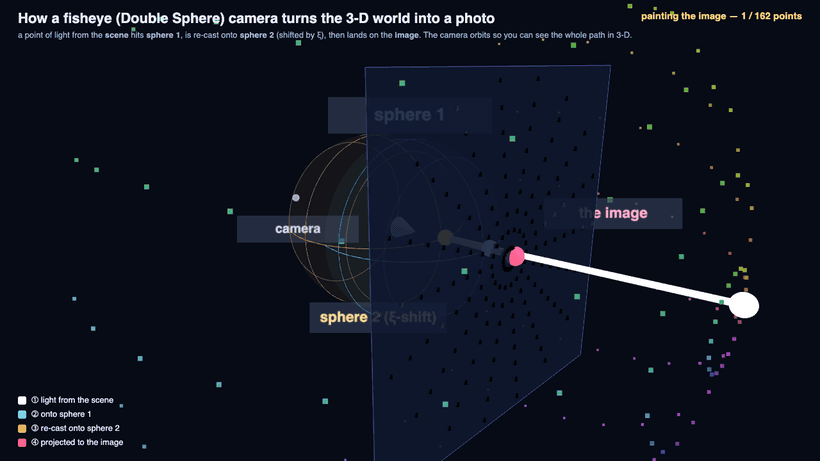
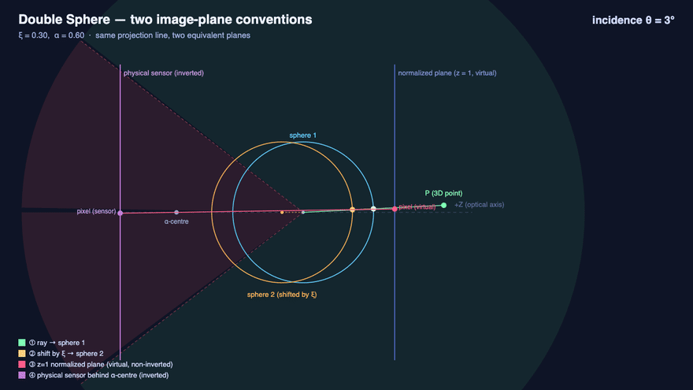
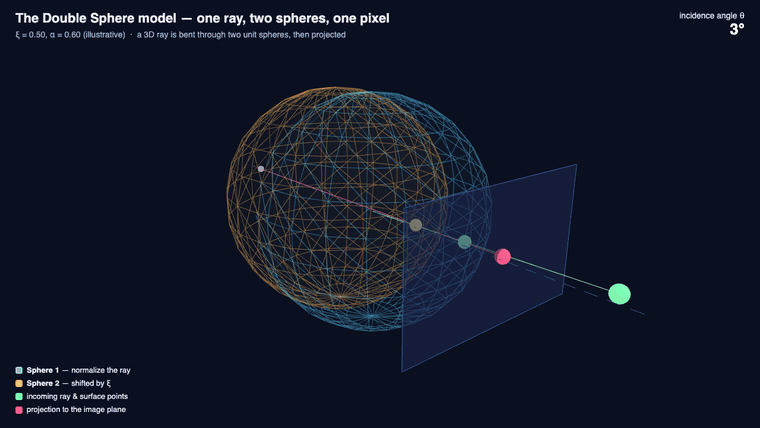

# Chapter 2 — The Double Sphere model, from first principles

> **Run alongside this:** `python examples/02_double_sphere_tumvi.py`
> (after the [setup](README.md#setup-once)). Read this, then read the printed numbers.

In [Chapter 1](01_fisheye_and_camera_models.md) a camera model was a black box: a
`project`/`unproject` pair that happened to be inverses. This chapter opens one specific
box — **Double Sphere** (Usenko, Demmel & Cremers, 3DV 2018) — and shows that its math is
short, geometric, and exactly invertible. By the end you'll read
[`ds_msp/models/ds_math.py`](../../ds_msp/models/ds_math.py) and recognize every line.



*The whole idea in one picture: follow the bright point as it travels **3D point → sphere 1 →
sphere 2 → α-centre**, while a colourful world of directions fills in the image. The same
projection ray meets **two equivalent image planes** — the model's normalized **z = 1 plane**
(virtual, upright) and the **physical sensor** behind both spheres (real, inverted). Every
coloured pixel is the exact `ds_project` of its 3D direction — even the ones past 90°, which a
normal camera cannot capture.*

The model is radially symmetric, so a 2-D cross-section is the complete picture — the same
construction with both image planes labelled:



*The two spheres sit between the 3-D world (right) and the sensor (left, behind the α-centre),
matching the paper's figure; the z = 1 plane in front carries the equivalent upright image. The
sections below dissect each step.*

## 1. Why another model after Kannala-Brandt?

Kannala-Brandt (Chapter 1's model) describes the lens by a polynomial in the incidence
angle θ: `r(θ) = θ + k1·θ³ + k2·θ⁵ + …`. It fits well, but it has a practical wart:
**unprojection has no closed form.** To go from a pixel back to a ray you must invert that
polynomial numerically (Newton iterations) for *every pixel, every frame*. In a VO/SLAM
front-end unprojecting thousands of features per image, that adds up.

Double Sphere was designed to fix exactly this: it matches fisheye lenses as well as KB
while keeping **both** projection and unprojection in closed form — no iteration, no
root-finding. That single property is why it shows up in modern visual-inertial systems
(it's the model behind Basalt). The whole point of this chapter is to see *why* it inverts
cleanly.

## 2. The geometric picture: two spheres

Pinhole projection divides by `Z`. That explodes as a ray approaches 90° (`Z → 0`). The
fix every wide-FOV model uses is the same idea: **first map the ray onto a unit sphere
(where nothing explodes), then do a perspective division from a shifted center.** Models
differ only in *where* that second center sits.

Double Sphere uses *two* unit spheres in sequence, governed by two new numbers:

1. **Project the 3D point onto a first unit sphere** — just normalize it. Now every
   direction, even one 100° off-axis, is a finite point on a sphere.
2. **Shift by `ξ` (xi) and project onto a second unit sphere.** `ξ` is the gap between the
   two sphere centers. This second bending is what lets the model curve enough for real
   fisheye glass.
3. **Pinhole-project from a center blended by `α` (alpha).** `α` slides the projection
   center between "the second sphere's center" (`α=1`) and "one sphere-radius behind it"
   (`α=0`). It controls how much perspective foreshortening remains.

So Double Sphere = pinhole + two shape knobs: **`ξ` (sphere spacing)** and **`α` (which
center you project from)**. Everything else (`fx, fy, cx, cy`) is the ordinary intrinsic
matrix you already know.



*The construction in cross-section (the model is radially symmetric, so this slice is the
whole story): an incoming ray (green) lands on the **first** unit sphere, is **shifted by `ξ`**
onto the **second** sphere (orange), then **projected from the `α`-blended centre** onto the
image plane — a pixel (pink). The shaded wedge is the valid field of view; watch `θ` climb
**past 90°** and still land inside it — the >180° reach a pinhole can never have. (Rendered
from the exact `ds_project` geometry — every point matches the library to ~1e-16.)*

## 3. Read the projection in code

Here is the entire forward map from
[`ds_math.py`](../../ds_msp/models/ds_math.py) — six lines of real arithmetic:

```python
d1  = np.sqrt(x*x + y*y + z*z)          # distance to sphere 1  (normalize the ray)
z1  = z + xi * d1                        # shift the z by xi  -> center of sphere 2
d2  = np.sqrt(x*x + y*y + z1*z1)         # distance to sphere 2
den = alpha * d2 + (1.0 - alpha) * z1    # the alpha-blended projection denominator
u   = fx * x / den + cx
v   = fy * y / den + cy
```

Match it to the geometry:
- `d1` normalizes onto **sphere 1**.
- `z1 = z + ξ·d1` is the **ξ shift** — it pushes the point's `z` toward the second sphere's
  center. With `ξ = 0` this line vanishes and the two spheres collapse into one (Double
  Sphere degenerates to the **Unified Camera Model**, UCM).
- `den = α·d2 + (1−α)·z1` is the **α blend** of the two possible denominators. With
  `α = 0` you divide by `z1` (pure UCM-style); with `α = 1` you divide by `d2`. Real
  fisheyes land in between — TUM-VI's is `α ≈ 0.71` (the example prints it).
- The last two lines are the pinhole division you've seen a hundred times, just with `den`
  in place of `Z`.

That's the whole model. Two extra scalars on top of a pinhole.

## 4. Why it inverts in closed form

The reason Double Sphere unprojects without iteration: the forward map is a composition of
a normalization and a *quadratic* perspective step, and a quadratic can be solved with a
square root rather than Newton's method. You can see the solved result directly in
[`ds_unproject`](../../ds_msp/models/ds_math.py):

```python
mx = (u - cx) / fx;  my = (v - cy) / fy;  r2 = mx*mx + my*my
mz = (1.0 - alpha*alpha * r2) / (alpha * np.sqrt(s) + (1.0 - alpha))   # the closed form
```

No loop. That `np.sqrt` is the analytic inverse of the quadratic in §3 — which is exactly
why the round-trip in the example hits machine precision:

```
project(unproject(u)) round-trip: mean=2.17e-14px  max=1.17e-13px
```

`1e-13 px` is float64's last bit. Contrast Chapter 1's verify-don't-trust habit: this isn't
"close enough", it's *the model is its own exact inverse*, and the test proves it on 1600
real TUM-VI pixels. (The `s ≥ 0` and `sqrt_arg ≥ 0` checks in the code are where rays that
the lens physically can't see get flagged invalid — that's Chapter 3.)

## 5. Is Double Sphere expressive enough for a *real* lens?

A model that inverts cleanly is useless if it can't actually fit real glass. So: TUM-VI's
authors calibrated their fisheye and published it as a Kannala-Brandt model. Can a Double
Sphere model describe the **same** camera?

The example re-expresses it with the library's own [`convert()`](../../ds_msp/adapt/convert.py)
(sample pixels → unproject through the reference → seed → Levenberg-Marquardt refine with
the model's *analytic* Jacobian), then measures agreement over the whole frame:

```
Recovered Double Sphere: fx=240.178 fy=240.172 cx=254.932 cy=256.897 xi=0.2584 alpha=0.7110

Evaluated over 1879 rays spanning 179.8 deg of field of view:
    RMS  reprojection error : 0.0106 px
    max  reprojection error : 0.0249 px
```

**0.025 px maximum disagreement across a ~180° field** — Double Sphere has the expressive
power to capture this lens to a fortieth of a pixel. (Notice `fx` changed from 191 to 240:
focal length is *model-relative* — the same lens has a different `fx` under KB vs DS because
the denominators differ. The true paraxial focal is `fx_DS/(1+ξ)`; a whole deep-dive proves
this — **[are two models the same camera?](are_two_models_the_same_camera.md)**. What's
invariant is where rays land, not the raw numbers.)

> **This is model *conversion*, not calibration.** We re-expressed one set of published
> numbers as another model's numbers — no images, no board, no detected corners. Proving
> the model on *real measurements* is the **[capstone](capstone_calibrating_a_real_camera.md)**:
> detect AprilGrid corners in TUM-VI's raw calibration footage and bundle-adjust intrinsics
> from scratch that land on the published reference. Do Chapter 2, then jump to it — it's
> the artifact everything here builds toward.

## Try it yourself
1. In the example, after `convert()`, print `ds.xi` while forcing `xi = 0`
   (`DoubleSphereModel(ds.fx, ds.fy, ds.cx, ds.cy, 0.0, ds.alpha)`) and re-measure the
   reprojection error. How much worse does the single-sphere (UCM) fit get? That gap is
   what the second sphere buys you.
2. Convert to `EUCMModel` and `UCMModel` instead and compare their max reprojection error
   to Double Sphere's. Which models reproduce this lens best?
3. Run the round-trip grid (§4) out to the image corners (`np.linspace(0, W, …)`) and watch
   how many pixels drop out of the valid mask near the edge — a preview of Chapter 3.

**Next:** the **[capstone](capstone_calibrating_a_real_camera.md)** — calibrate this camera
for real from AprilGrid footage and match the published numbers. Or continue the theory
thread with **[Chapter 3](03_projection_validity.md)** — projection validity and the >180°
cone (why `z > 0` is the classic fisheye bug).
