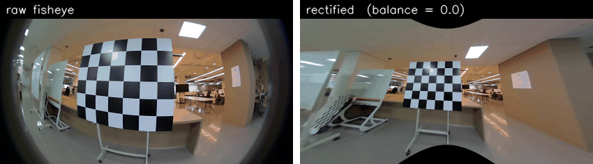

# Chapter 3 — Projection validity & the >180° cone

> **Run alongside this:** `python examples/07_fov_and_validity.py` (after the
> [setup](README.md#setup-once)). Read this, then read the printed numbers.

A fisheye lens sees **more than a hemisphere** — past 90° off-axis, even slightly behind the
camera. That's the whole point of it. But it raises a question almost no tutorial answers
clearly: *exactly where does "the camera can see this" end?* This chapter draws that
boundary, puts a number on it, and shows why it's also the reason a rectified fisheye image
always has a black border.

The images here come from the original Double Sphere calibration this library grew from.

## 1. The boundary nobody draws

Here is the camera's world from directly above — the `XZ` plane, camera at the origin
looking along `+Z`:


The **green** region is where the model can project a ray to a pixel; the **blue** region
below is the *invalid cone* it cannot. The black stars are real calibration keypoints — and
notice they arc well past the `X`-axis (90°), into rays that point slightly *backward*
(`z < 0`) yet are still green. A pinhole camera's valid region would be only the top half
(`z > 0`); the fisheye's is much larger. The exact shape of that green region is what the
rest of this chapter is about.

## 2. The validity test is a half-space — not `z > 0`

The naive guess for "can the camera see this point?" is `z > 0` (is it in front?). For a
fisheye that is **wrong**, and it's the single most common implementation bug — it silently
throws away every ray past 90°, capping a >180° lens at exactly 180°.

The correct test (Usenko et al. 2018, Eq. 43–45), implemented in
[`ds_msp/models/ds_math.py`](../../ds_msp/models/ds_math.py), is a tilted half-space:

$$z > -w_2\, d_1, \qquad d_1 = \sqrt{x^2 + y^2 + z^2}$$

where `w₂` is a constant built from the model's `α` and `ξ`. For a unit-length ray
(`d₁ = 1`) at incidence angle `θ`, `z = cos θ`, so the test becomes simply `cos θ > −w₂` —
i.e. every ray out to

$$\theta_{\max} = \arccos(-w_2)$$

is valid. The example computes this for the original calibration (`ξ=0.183, α=0.809`):

```
w2 (half-space coefficient) = 0.3967
max valid incidence angle   = 113.4 deg   (numeric check: 113.3 deg)
=> the model accepts a field of view up to 227 deg — well beyond a 180 deg hemisphere.
```

**113.4°**, not 90° — the camera accepts rays 23° *behind* its own side. The analytic value
matches a brute-force sweep of 4000 rays to the first decimal, so the formula is right. A
`z > 0` test would have stopped at 90° and quietly discarded a quarter of the lens.

## 3. The same cone, painted onto a real frame

The top-down diagram is the geometry; here is the *same* valid region mapped back onto a
real fisheye image:


- **Green — frontal (`θ < 90°`):** ordinary forward rays; a pinhole could handle these.
- **Yellow — side/back (`90° ≤ θ < θ_max`):** valid in Double Sphere (`z ≤ 0`!), but
  impossible to put into a single pinhole image. These are the rays the naive bug drops.
- **Red — the invalid cone (`θ ≥ θ_max`):** outside the model's domain entirely.
- **White stars:** the real calibration keypoints — all safely inside the valid region.

This is the picture to keep in your head: "in front of the camera" (pinhole) is a small
green disc inside the much larger green-plus-yellow region a fisheye actually sees.

## 4. Why you can't undistort it all away

If the lens sees 227°, why does the rectified "pinhole view" always cut some of it off?
Because a **pinhole image plane is infinite at 90°**: a ray at exactly 90° projects to
`x/z → ∞`. There is no finite image that holds the yellow zone. Those pixels aren't lost to
a bug — they are *geometrically un-pinhole-able*.

So rectification forces a trade, controlled by the `balance` knob. The example measures both
sides of it:

```
balance   rectified hFOV   frame filled (non-black)
 0.00       147.0 deg         92.5 %
 0.50       132.1 deg         99.9 %
 1.00       118.7 deg        100.0 %
```



- **`balance = 0`** keeps the widest view (147° here) but leaves a **black border** — the
  corners of the output map to rays the source frame never captured.
- **`balance = 1`** crops until the frame is 100% filled, but throws ~30° of field of view
  away.

The original "coverage" frame below makes the same point from the other direction — the red
circle is the lens's actual image footprint, and *everything outside it* (the dark corners)
is sensor with no light, which is why a flat rectification can never fill those corners
without zooming in:


## 5. What you can now reason about

- A fisheye's "can I see it?" test is a **tilted half-space `z > −w₂·d₁`**, not `z > 0`.
- That half-space corresponds to a **valid cone** wider than a hemisphere — here 227°.
- Undistortion to a pinhole **cannot keep the part past 90°**, so `balance` trades field of
  view against black border; you choose where on that curve to sit.

## Try it yourself
1. Re-run the example after editing `test_config.json` to set `alpha = 0.5`. Predict whether
   `θ_max` grows or shrinks before you look. (Hint: at `α ≤ 0.5` the model degenerates toward
   UCM and `w₂` changes piecewise.)
2. Add a `balance = -0.5` row to the sweep. What happens to the hFOV and the fill percentage?
3. Project a single ray at exactly `θ = 113°` and at `θ = 114°` and check the `valid` mask —
   you've found the edge of the cone by hand.

**Next:** [Chapter 4](04_jacobians.md) — analytic Jacobians vs autodiff: derive the
projection's exact derivative and gradient-check it. *(coming soon — see
[`../ROADMAP.md`](../ROADMAP.md))*
