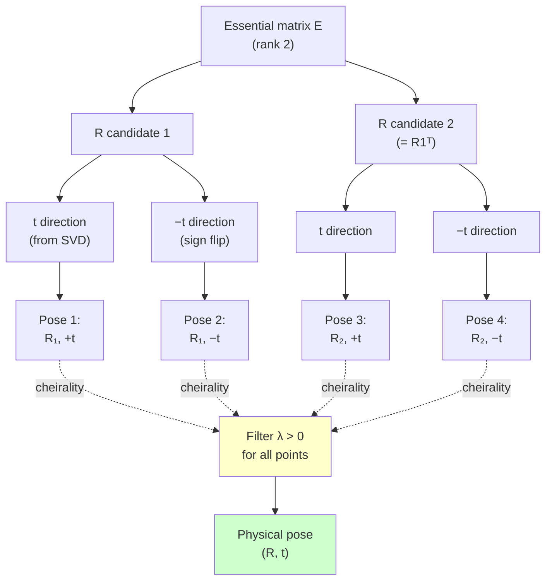

# Chapter 8 — Two-view geometry on rays

> **For:** readers who can already turn a fisheye pixel into a bearing ray (Chapters 1–3)
> and now want the relative pose `(R, t)` between two views of the same scene — without ever
> touching a pinhole.

Two images of one rigid scene fix the camera's motion between them, **up to the scale of the
translation**. This chapter recovers that motion from feature correspondences expressed as
**unit bearing rays** — the native currency of a wide-FOV camera. You'll go from 8 ray pairs
to a pose in five lines, see why the math is identical for any central camera, make it robust
to wrong matches, and finish on a real TUM-VI fisheye pair.

> **You'll learn**
> - Recover `(R, t)` from ray correspondences with `recover_pose` — and prove it on a
>   synthetic Double Sphere scene to **< 1e-3°**.
> - Why the eight-point algorithm works on bearings, not just pixels.
> - The cheirality step, and why "in front" is **positive depth along the bearing ray**
>   (`λ > 0`), not `z > 0` (the Chapter 3 callback).
> - Make pose robust to outliers with `ransac_relative_pose`: **< 0.5°** under 30% bad matches.
>
> **Prerequisites**
> - **[Chapter 1](01_fisheye_and_camera_models.md)** — `project`/`unproject` are inverses; a
>   ray is `unproject(pixel)`.
> - **[Chapter 3](03_projection_validity.md)** — why `z > 0` is the wrong validity/cheirality
>   test for a >180° lens.
> - You've run the dataset fetcher (for §6). Setup: the [project README](README.md#setup-once).
>
> **Theory lives elsewhere.** This is a tutorial: it runs code and reports numbers. For the
> epipolar-constraint derivation, the four-fold decomposition proof, and numerical-stability
> notes, read the explanation page **[Two-view geometry](../explain/two_view_geometry.md)**.
> The chapter links to it; it does not restate it.

## On this page
- [The smallest thing that works](#1-the-smallest-thing-that-works-rays-in-pose-out)
- [Why rays, not pixels](#2-why-rays-not-pixels)
- [The eight-point estimator](#3-the-eight-point-estimator-on-rays)
- [Cheirality and decomposition](#4-decompose-and-pick-the-physical-pose-the-cheirality-step)
- [Robust matching with RANSAC](#5-make-it-robust-ransac-against-wrong-matches)
- [Real data: TUM-VI](#6-on-real-data-a-tum-vi-fisheye-pair)
- [Exercises](#try-it-yourself)

---

## 1. The smallest thing that works: rays in, pose out

Give `recover_pose` eight or more ray correspondences and it returns the relative rotation,
the unit translation direction, and the triangulated 3D points. Here is the complete API call on a
synthetic scene, before any theory:

```python
import numpy as np
from ds_msp.mvg import recover_pose

# A ground-truth relative pose (R, t) maps a point from camera 1 to camera 2: X2 = R @ X1 + t.
def rodrigues(axis, angle):
    a = np.asarray(axis, float); a = a / np.linalg.norm(a)
    K = np.array([[0, -a[2], a[1]], [a[2], 0, -a[0]], [-a[1], a[0], 0]])
    return np.eye(3) + np.sin(angle) * K + (1 - np.cos(angle)) * (K @ K)

rng = np.random.default_rng(1)
R_true = rodrigues(rng.standard_normal(3), 0.6)        # 0.6 rad rotation
t_true = rng.standard_normal(3); t_true /= np.linalg.norm(t_true)   # unit translation

# 40 random 3D points in front of camera 1, seen by both cameras.
X1 = np.column_stack([rng.uniform(-2, 2, 40), rng.uniform(-2, 2, 40), rng.uniform(2, 8, 40)])
X2 = (R_true @ X1.T).T + t_true

# Turn each point into a unit BEARING RAY in its camera (no pixels, no model — just directions).
f1 = X1 / np.linalg.norm(X1, axis=1, keepdims=True)    # (40, 3) unit rays, camera 1
f2 = X2 / np.linalg.norm(X2, axis=1, keepdims=True)    # (40, 3) unit rays, camera 2

R, t, X = recover_pose(f1, f2)                          # R: (3,3), t: (3,) unit, X: (40,3)

def rot_err_deg(A, B):
    return np.degrees(np.arccos(np.clip((np.trace(A.T @ B) - 1) / 2, -1, 1)))
def dir_err_deg(a, b):
    a, b = a / np.linalg.norm(a), b / np.linalg.norm(b)
    return np.degrees(np.arccos(np.clip(abs(a @ b), -1, 1)))

print(f"rotation error       : {rot_err_deg(R_true, R):.2e} deg")
print(f"translation-dir error: {dir_err_deg(t_true, t):.2e} deg")
```

You build the rays straight from the 3D points, so no pixel and no lens model ever touch
them. With no noise to absorb, `recover_pose` inverts the geometry exactly — both errors come
back as machine-precision zero (`0.00e+00`), the float64 round-off floor. In §4 the same demo
routes points through a real camera's project/unproject, and the errors there are tiny but
*nonzero* for exactly that reason.

Expected output:

```
rotation error       : 0.00e+00 deg
translation-dir error: 0.00e+00 deg
```

That is the entire workflow. The rest of this chapter walks each piece, makes it survive real
data, and replaces "0.00e+00" with the honest numbers a real fisheye stream gives you.

> **Why only a translation *direction*?** Two views can't tell a small scene nearby from a
> big scene far away — both look identical. So `t` comes back **unit-length**; its scale is
> unobservable from two views. `recover_pose` fixes the *sign* of `t` by cheirality (§4).

---

## 2. Why rays, not pixels

The eight-point algorithm you may have seen on pixels is really an algorithm on **directions**.
The calibrated epipolar constraint is

```
f2ᵀ E f1 = 0,        E = [t]_× R   (the essential matrix, rank 2)
```

and it holds for the **unit bearing rays** `f1, f2` of *any* central camera — pinhole, Double
Sphere, Kannala-Brandt, UCM. Nothing in it is pinhole-specific.

The pixel-domain version you may have met is a special case. It works only because a pinhole
relates each pixel to its ray through one matrix `K`. A fisheye has no such `K`: its
pixel-to-ray map is the curved `unproject` of Chapters 1–2. So you do the geometry one step
earlier — on the rays themselves — and the same estimator works for a 195° lens. That is why
everything in `ds_msp.mvg` takes `(N, 3)` rays.

For *why* `f2ᵀ E f1 = 0` follows from the geometry, and why `E` has rank 2 with singular
values `(1, 1, 0)`, see **[Two-view geometry → the epipolar constraint](../explain/two_view_geometry.md)**.

---

## 3. The eight-point estimator on rays

`essential_from_rays` is the least-squares core: it solves `f2ᵀ E f1 = 0` over all
correspondences for the essential matrix `E`. Measure how well the result fits with
`epipolar_residual`, which returns `f2ᵀ E f1` per pair — zero for a perfect fit.

The following snippet continues the setup from §1 (`f1`, `f2` are the synthetic rays):

```python
from ds_msp.mvg import essential_from_rays, epipolar_residual

E = essential_from_rays(f1, f2)                 # (3, 3), rank 2
residual = epipolar_residual(E, f1, f2)         # (40,) algebraic residual, one per pair
print(f"max epipolar residual: {np.abs(residual).max():.2e}")
```

Expected output (clean rays — the constraint is satisfied to machine precision):

```
max epipolar residual: 5.69e-16
```

`5.69e-16` is float64 round-off: on noise-free data the rays satisfy `f2ᵀ E f1 = 0` exactly.

`essential_from_rays` needs **at least 8** correspondences; fewer raises `ValueError`. It also
takes an optional `normalize=True` for spherical pre-conditioning — it helps on noisy,
narrow-baseline rays and changes nothing in the noise-free limit. You don't call it directly in
this chapter; the real-data re-fit in
[`examples/10_two_view_pose_tumvi.py`](https://github.com/Munna-Manoj/DS-MSP/blob/main/examples/10_two_view_pose_tumvi.py) uses it.

---

## 4. Decompose and pick the physical pose — the cheirality step

An essential matrix does **not** uniquely give `(R, t)`: it factors into **four** candidates.
The decomposition splits `E = [t]_× R` into two possible rotation matrices and two possible
translation directions (±`t`). `recover_pose` builds all four, then applies **cheirality** to
pick the one where the triangulated points lie in front of both cameras.

The four-way split and cheirality selection flow:



!!! warning "The >180° callback (Chapter 3)"
    "In front" means **positive depth *along the bearing ray*** — the scale `λ > 0` in
    `triangulate_rays` — **not** `z > 0`. A ray past 90° off-axis has a negative `z` and
    still observes a point the lens genuinely sees. Using `z > 0` as the cheirality test would
    reject every wide-angle correspondence and pick the wrong one of the four poses.
    [Chapter 3](03_projection_validity.md#2-the-validity-test-is-a-half-space-not-z-0)
    made this point for the *validity* mask (the `z > -w₂·d₁` half-space, valid out to ~227°);
    cheirality is the same point, one stage later.

Now the headline number. The §1 demo used hand-made rays; this one drives them through a real
wide-FOV camera model — `DoubleSphereModel` — to prove the pipeline is genuinely model-agnostic:
project 3D points to fisheye pixels in two views, unproject back to rays, recover the pose.
This mirrors `tests/mvg/test_two_view.py::test_recover_pose_through_a_real_double_sphere_camera`
exactly, so the number is asserted in CI. Here is the complete round-trip:

```python
from ds_msp.models import DoubleSphereModel

cam = DoubleSphereModel(fx=300.0, fy=300.0, cx=320.0, cy=320.0, xi=0.3, alpha=0.6)
rng = np.random.default_rng(7)
R_true = rodrigues(rng.standard_normal(3), 0.5)
t_true = rng.standard_normal(3); t_true /= np.linalg.norm(t_true)

X1 = np.column_stack([rng.uniform(-3, 3, 60), rng.uniform(-3, 3, 60), rng.uniform(2, 9, 60)])
X2 = (R_true @ X1.T).T + t_true

uv1, ok1 = cam.project(X1)            # 3D -> fisheye pixels, view 1; ok1: (60,) valid mask
uv2, ok2 = cam.project(X2)            # 3D -> fisheye pixels, view 2
ok = ok1 & ok2
f1, _ = cam.unproject(uv1[ok])        # pixels -> unit rays, view 1
f2, _ = cam.unproject(uv2[ok])        # pixels -> unit rays, view 2

R, t, X = recover_pose(f1, f2)
print(f"valid pairs          : {int(ok.sum())}")
print(f"rotation error       : {rot_err_deg(R_true, R):.2e} deg")
print(f"translation-dir error: {dir_err_deg(t_true, t):.2e} deg")
```

Expected output:

```
valid pairs          : 60
rotation error       : 1.21e-06 deg
translation-dir error: 0.00e+00 deg
```

**Rotation error `~1.2e-6°`, translation-direction error `~0°`** — well under the `1e-3°`
the test asserts. The pose is exact to the precision of the camera's project/unproject
round-trip; the two-view geometry adds no error of its own. Notice that `mvg` never learns it
was looking at a fisheye: it only ever saw rays. That is the payoff of working on bearings.

Notice too that all **60** pairs survive the `ok` mask. Every point here falls inside the
lens's valid cone (the [Chapter 3](03_projection_validity.md#2-the-validity-test-is-a-half-space-not-z-0)
half-space), so `project` flags none of them invalid and the mask filters nothing. Spread the
scene wider — past the `θ_max` boundary Chapter 3 measures — and some points would drop out,
leaving fewer than 60 pairs. The pipeline handles that for free: it only ever feeds the
surviving rays to `recover_pose`.

For the proof that exactly four decompositions exist and why cheirality selects one, see
**[Two-view geometry → decomposing the essential matrix](../explain/two_view_geometry.md)**.

---

## 5. Make it robust: RANSAC against wrong matches

The eight-point estimator is least-squares, so a handful of mismatched rays — inevitable from
a real feature matcher — drag the whole fit off. `ransac_relative_pose` wraps the estimator in
RANSAC: it samples minimal sets, scores each candidate `E` by how many correspondences fit,
and re-fits on the consensus. It scores with a **Sampson distance on the sphere**, which is an
**angle in radians**, so the inlier threshold is FOV-independent — the right currency for a
fisheye, where a pixel threshold means different angles at the centre and the rim.

Corrupt 30% of the matches and compare the naïve eight-point against RANSAC. The following
self-contained snippet shows the difference:

```python
import numpy as np
from ds_msp.mvg import recover_pose, essential_from_rays, ransac_relative_pose

def rodrigues(axis, angle):
    a = np.asarray(axis, float); a = a / np.linalg.norm(a)
    K = np.array([[0, -a[2], a[1]], [a[2], 0, -a[0]], [-a[1], a[0], 0]])
    return np.eye(3) + np.sin(angle) * K + (1 - np.cos(angle)) * (K @ K)
def rot_err_deg(A, B):
    return np.degrees(np.arccos(np.clip((np.trace(A.T @ B) - 1) / 2, -1, 1)))
def dir_err_deg(a, b):
    a, b = a / np.linalg.norm(a), b / np.linalg.norm(b)
    return np.degrees(np.arccos(np.clip(abs(a @ b), -1, 1)))

rng = np.random.default_rng(3)
R_true = rodrigues(rng.standard_normal(3), 0.6)
t_true = rng.standard_normal(3); t_true /= np.linalg.norm(t_true)
X1 = np.column_stack([rng.uniform(-2, 2, 120), rng.uniform(-2, 2, 120), rng.uniform(2, 8, 120)])
X2 = (R_true @ X1.T).T + t_true
f1 = X1 / np.linalg.norm(X1, axis=1, keepdims=True)
f2 = X2 / np.linalg.norm(X2, axis=1, keepdims=True)

# Corrupt 30% of camera-2 rays with random directions (the "wrong matches").
rng2 = np.random.default_rng(4)
outlier = rng2.random(120) < 0.30
f2_bad = f2.copy()
f2_bad[outlier] = rng2.standard_normal((int(outlier.sum()), 3))
f2_bad /= np.linalg.norm(f2_bad, axis=1, keepdims=True)

# Naïve eight-point on the contaminated rays:
R_naive, _, _ = recover_pose(f1, f2_bad, essential_from_rays(f1, f2_bad))

# Robust: RANSAC with a 0.005 rad (~0.3°) angular inlier threshold.
R_rob, t_rob, inliers = ransac_relative_pose(f1, f2_bad, threshold=0.005, seed=0)

truth = ~outlier
precision = (inliers & truth).sum() / max(inliers.sum(), 1)
recall = (inliers & truth).sum() / truth.sum()

print(f"naïve  rotation error : {rot_err_deg(R_true, R_naive):.2f} deg")
print(f"RANSAC rotation error : {rot_err_deg(R_true, R_rob):.3f} deg")
print(f"RANSAC trans-dir error: {dir_err_deg(t_true, t_rob):.3f} deg")
print(f"inlier precision/recall: {precision:.3f} / {recall:.3f}  ({int(inliers.sum())}/120)")
```

Expected output:

```
naïve  rotation error : 26.78 deg
RANSAC rotation error : 0.107 deg
RANSAC trans-dir error: 0.274 deg
inlier precision/recall: 0.989 / 1.000  (92/120)
```

Here is a summary of how RANSAC recovers from 30% corrupted matches:

| Metric | Naïve eight-point | RANSAC |
| :--- | ---: | ---: |
| Rotation error | 26.78° | 0.107° |
| Translation-direction error | — | 0.274° |
| Inlier precision | — | 0.989 |
| Inlier recall | — | 1.000 |

The naïve fit is **~27° off** — useless. RANSAC recovers rotation to **0.107°** and the
translation direction to **0.274°**, with inlier **precision 0.989 / recall 1.000**: it found
every one of the ~91 good matches and admitted almost no bad ones. The thresholds asserted in
`tests/mvg/test_ransac.py` are rotation `< 0.5°`, translation-direction `< 2.0°`, precision
`> 0.95`, recall `> 0.9` — all met with margin.

> **Notice** how this scales as you push exercise 2's outlier fraction up. RANSAC's iteration
> budget tracks the inlier ratio: the fraction of random 8-samples that land *all* inliers
> drops fast as outliers rise. At very low inlier ratios the default `max_iters=1000` may never
> draw a clean 8-sample, and recall collapses. Raising `max_iters` buys back some headroom.

---

## 6. On real data: a TUM-VI fisheye pair

Synthetic rays are noise-free; real ones are not. The companion example
[`examples/10_two_view_pose_tumvi.py`](https://github.com/Munna-Manoj/DS-MSP/blob/main/examples/10_two_view_pose_tumvi.py) runs the
exact same pipeline on two real TUM-VI `room1` fisheye frames: it KLT-tracks features between
them (reusing the tracker from [`examples/09`](https://github.com/Munna-Manoj/DS-MSP/blob/main/examples/09_monocular_vo_tumvi.py)),
unprojects both pixel sets through the **loaded** calibrated model to rays, and runs
`ransac_relative_pose`. Run it with:

```bash
python examples/10_two_view_pose_tumvi.py --start 400 --gap 4
```

Expected output:

```
camera: KannalaBrandtModel  fx=190.98 cx=254.93
frames 400 -> 404: 73 KLT matches
valid bearing pairs: 73 / 73

RANSAC relative pose (71 inliers / 73 = 97.3%):
  inlier Sampson residual: median 6.11e-04 rad  max 3.81e-03 rad  (~0.035 deg)
  recovered |t| direction vs mocap baseline: ~45.4 deg (coarse; camera!=world frame)
```

!!! note "End-to-end on real fisheye"
    The pipeline runs on a real TUM-VI fisheye stream. RANSAC keeps **71 of 73** matches
    (97.3% inliers) with a median angular residual of **~6e-4 rad (~0.035°)** — the inliers
    agree on a single consistent pose to a few hundredths of a degree.

!!! warning "Demonstration, not a guarantee"
    The deterministic correctness claim is the synthetic round-trip in §4 (`< 1e-3°`, asserted
    in CI). On real data the translation *direction* check against the mocap baseline is only
    coarse — the recovered `t` lives in the camera frame, the mocap baseline in the world/body
    frame, and there's a camera-to-body lever arm — so don't read the `~45°` as pose error.
    It's a sign-and-sanity check that the motion points somewhere plausible. A rigorous,
    frame-aligned evaluation is what Chapter 9 builds toward.

> **Notice** the camera printed as `KannalaBrandtModel`, not Double Sphere — that's the model
> TUM-VI ships in its calibration file. The two-view code didn't care: it only ever saw rays.
> That's §2's model-agnostic claim, demonstrated on a different model than §4 used.

---

## Try it yourself

Predict first, then run. The exercises below ask you to change one parameter and observe how
it affects the pose estimate:

1. **Vary the rotation magnitude.** In §1, change `0.6` in `rodrigues(rng.standard_normal(3),
   0.6)` to `0.05` (a tiny rotation, almost no parallax). Predict first: does the error grow or
   stay near zero? Then add noise — `f2 += 1e-3 * rng.standard_normal(f2.shape)` — and re-run.
   Small-baseline two-view geometry is ill-conditioned; watch the error climb far faster at
   `0.05` than at `0.6`.
2. **Push the outlier fraction.** In §5, raise `0.30` to `0.50`, then `0.70`. Predict where
   RANSAC's recall collapses before you run it.
3. **Move the real pair apart.** Run example 10 with `--gap 1` (tiny baseline) and `--gap 12`
   (large baseline, fewer surviving tracks). Which gives the lower Sampson residual, and why is
   the tiny-baseline case noisier even with more matches?

## Recap and next step

You recovered relative pose from bearing rays with `recover_pose`, proved it exact on a
synthetic Double Sphere scene (**~1e-6°**, CI-asserted `< 1e-3°`), made it robust with
`ransac_relative_pose` (**0.107°** under 30% outliers), and ran the whole thing on a real
TUM-VI fisheye pair (**~97% inliers, ~0.035° residual**).

The pose here is a closed-form two-view estimate. The next step is to **refine** it.
`refine_two_view` runs iterative Levenberg–Marquardt on the rotation–translation manifold (SO(3) × S²),
minimizing angular reprojection error to drive the residual below what the one-shot estimate
reaches. That closed-form pose becomes the seed, and the same machinery extends to chains of
poses and points — full bundle adjustment. That's **Chapter 9 — manifold optimization**
(`ds_msp.mvg.refine_two_view`).
