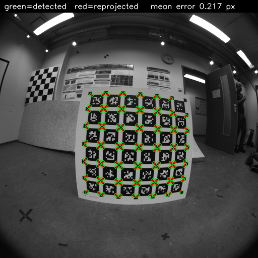
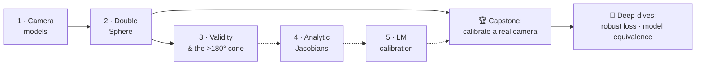

# Learn: fisheye & omnidirectional camera geometry, from first principles

A guided, **runnable** path through wide-FOV camera models — the geometry behind
SLAM, AR, and robot perception. Every chapter pairs a short explainer with a script
that runs on **real public data** and prints a **number you can verify**. That last
part is the whole point: in 3D vision you don't *hope* your math is right, you
*measure* that it is (a good unprojection inverts projection to ~1e-14 px, not "looks
about right").



*Where this leads — the [capstone](capstone_calibrating_a_real_camera.md): calibrate a real
fisheye from scratch until the model (red) predicts every detected corner (green) to a tenth
of a pixel, matching the published reference.*

This is the teaching layer. The library it teaches (`ds_msp/`) stays deliberately
clean and untouched by tutorial clutter — read the docs to learn, read the code to
see how it's done in production.

## Who this is for
Aspiring 3D-vision researchers, applied-perception engineers, and developers who know
some Python + linear algebra and want to *actually understand* (not just call) camera
models. No prior fisheye knowledge assumed.

## Setup (once)
```bash
# 1. Environment (uv recommended; venv/conda fine too)
uv venv --python 3.12 && source .venv/bin/activate
uv pip install -e .            # core library (Chapters 1–2)
uv pip install -e ".[calib]"   # + AprilGrid detector, for the calibration capstone

# 2. Data — small, free, ~3 GB for the fisheye track
bash scripts/download_datasets.sh tumvi
```
See [`datasets/README.md`](../../datasets/README.md) for what each dataset contains.

## The path



*Solid = the runnable path today (do Ch.1 → Ch.2 → capstone). Dotted = the theory chapters
that explain why each capstone step works (landing incrementally).*

| # | Chapter | You'll be able to… | Code anchor |
|---|---------|--------------------|-------------|
| 1 | [Fisheye & camera models](01_fisheye_and_camera_models.md) | load a real calibration, prove project/unproject are inverses, rectify a fisheye frame | `examples/01_realdata_fisheye_tumvi.py` |
| 2 | [The Double Sphere model](02_double_sphere_model.md) | derive DS projection, read it in code, and reproduce a published calibration with it | `examples/02_double_sphere_tumvi.py` |
| 3 | [Projection validity & the >180° cone](03_projection_validity.md) | explain why `z>0` is the classic bug, and *measure* the >180° valid cone (227° here) | `examples/07_fov_and_validity.py` |
| 4 | Analytic Jacobians vs autodiff *(coming soon)* | derive a Jacobian and gradient-check it | `ds_msp/model.py` |
| 5 | Calibration by Levenberg–Marquardt *(coming soon)* | calibrate from corner detections | `calibrate.py`, `ds_msp/calib/` |
| 6 | One model to another: conversion *(coming soon)* | turn a DS calib into KB/EUCM without re-shooting | `ds_msp/adapt/` |
| 7 | Reproducing a published calibration *(coming soon)* | match TUM-VI / EuRoC reference numbers with your own code | `ds_msp/io/kalibr.py` |

### 🏆 The capstone (runnable now)
**[Calibrate a real fisheye camera and match the published numbers](capstone_calibrating_a_real_camera.md)**
— detect AprilGrid corners in TUM-VI's raw footage, bundle-adjust the intrinsics from
scratch, and land on the calibration the dataset authors published to **0.003%** focal
(0.081 px median reprojection). This is the artifact the chapters build toward; you can run
it after Chapter 2. Code: `examples/03_calibrate_tumvi_aprilgrid.py`.

**Deep-dives:**
- [Detecting every AprilGrid tag, even at the fisheye periphery](robust_aprilgrid_detection.md)
  (`examples/03`) — why a fully-visible board drops to 4/36 tags off-centre, the multi-scale +
  board-guided recovery fix (36%→94% recall), and the two subpixel/pixel-centre subtleties that
  turn the recovered corners into a *tighter* calibration (focal 0.7%→0.003%).
- [Sphere, cylinder, pinhole: one camera, three images, and the pixel math that links them](spherical_and_cylindrical_reprojection.md)
  (`examples/08`) — why a fisheye on a sphere/cylinder is real geometry (not a trick), the exact
  pixel↔pixel maps between the three charts (verified to 1e-13 px round-trip), and where the
  cylinder silently drops the polar cone.
- [Robust losses vs hard rejection — and why naive RMS lies](robust_losses_and_evaluation.md)
  (`examples/04`) — how a Cauchy loss handles bad corners without discarding them, the IRLS
  weighting math, and why a robust fit must be scored by median / inlier RMS.
- [Are two different camera models the same camera?](are_two_models_the_same_camera.md)
  (`examples/05`) — why DS `fx≈152` and KB `fx≈191` are the same lens: the paraxial-focal
  derivation (`fx_DS/(1+ξ)`), project/unproject agreement vs field angle, and where two
  models stop agreeing (exactly where the data ran out).

Chapters land incrementally — see [`../ROADMAP.md`](../ROADMAP.md) for the build order.

## How to use it
Read the chapter, run its script, then **change one thing and predict what happens**
before you re-run (a different `balance`, a wider pixel grid, `cam1` instead of `cam0`).
The fastest way to learn geometry is to break it on purpose and watch the number move.
