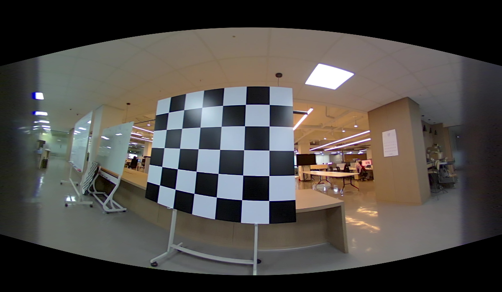
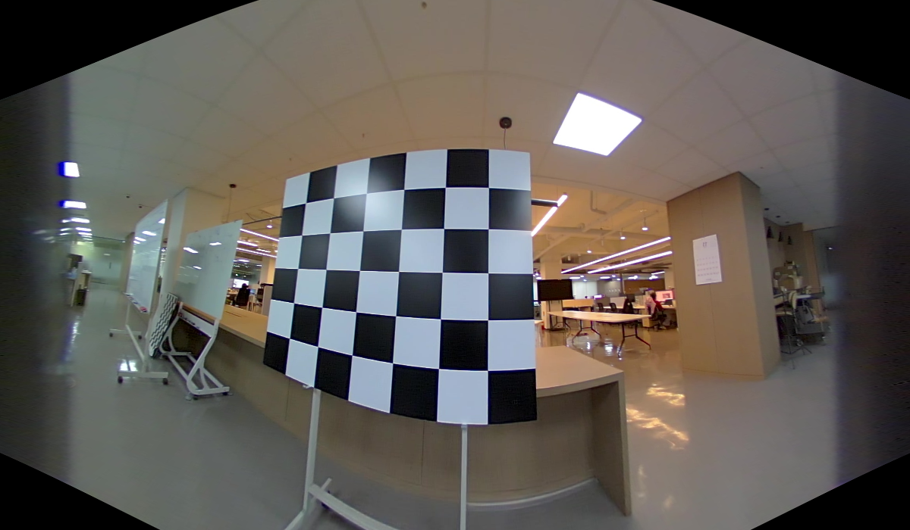
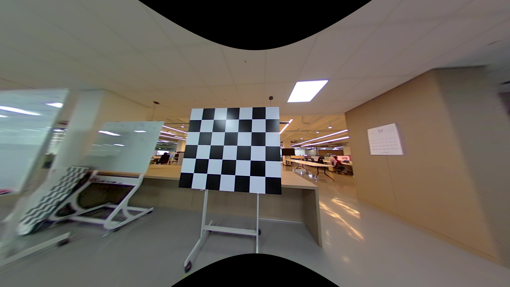
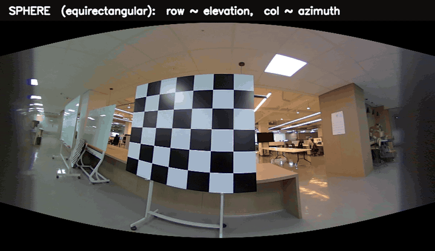

# Deep-dive — sphere, cylinder, pinhole: one camera, three images, and the pixel math that links them

> **Run alongside this:** `python examples/08_reproject_sphere_cylinder.py` (after the
> [setup](README.md#setup-once)). It writes the three images below and prints the round-trip
> residual that proves the maps are exact inverses.

You may have seen a fisheye frame "unwrapped" onto a **cylinder** or a **sphere**, with
landmarks drawn on the curved surface, and wondered: is that real geometry, or just a pretty
picture? Can a non-flat image even *have* intrinsics you can do 2D/3D work with?

Short answer: it's real, and the sphere version is **more** fundamental than the flat image
you started with. This deep-dive shows why, gives you the exact pixel↔pixel formulas to move
between **sphere ↔ cylinder ↔ pinhole**, and proves they round-trip to ~1e-13 px on the
bundled real fisheye.

## 1. A camera is a bijection between rays and pixels

A *central* camera is one where every light ray passes through a single point (the optical
centre). Such a camera is **completely** described by a one-to-one map between

- **ray directions** — unit vectors, i.e. points on the unit sphere $S^2$, and
- **pixel coordinates** $(u, v)$.

That's the whole object. A camera *model* is just a formula for that map (project) and its
inverse (unproject). The flat image plane is one **storage convention** for the bijection —
and a bad one past 90°, where the projection $\tan\theta \to \infty$. The unit sphere has no
such edge, which is exactly why fisheye models (Double Sphere included) put the sphere at
their core.

So "projecting onto a sphere" isn't a trick — it's writing the bijection on its natural
domain. The cylinder and the pinhole are two *other* charts of the same rays.

Throughout, the ray convention matches the library: **x right, y down, z forward**, and
`DoubleSphereCamera.project([x, y, z]) → (u, v)`. Every ray has two angles:

$$\underbrace{\lambda = \operatorname{atan2}(x,\, z)}_{\text{azimuth (longitude)}}
\qquad
\underbrace{\psi = \operatorname{atan2}\!\big(-y,\, \sqrt{x^2+z^2}\big)}_{\text{elevation (latitude)}}$$

with the inverse $\;(x, y, z) = (\cos\psi \sin\lambda,\; -\sin\psi,\; \cos\psi \cos\lambda)$.

## 2. Three charts, three sets of intrinsics

Each representation is a different rule for turning a ray's two angles into a pixel. All three
have honest *intrinsics* — a focal-like scale $f$ (pixels per radian, or per unit) and a
centre $(c_x, c_y)$. Here they are, forward (ray → pixel) and inverse (pixel → ray):

| Chart | Column law (azimuth) | Row law (elevation) | Inverse | Valid range |
|-------|----------------------|---------------------|---------|-------------|
| **Sphere** (equirectangular) | $u = c_x + f\,\lambda$ | $v = c_y - f\,\psi$ | $\lambda=\frac{u-c_x}{f},\ \psi=\frac{c_y-v}{f}$ | full $S^2$ |
| **Cylinder** | $u = c_x + f\,\lambda$ | $v = c_y - f\,\tan\psi$ | $\lambda=\frac{u-c_x}{f},\ \psi=\arctan\!\frac{c_y-v}{f}$ | $\lvert\psi\rvert<90°$ |
| **Pinhole** (gnomonic) | $u = c_x + f_p\,\dfrac{x}{z}$ | $v = c_y + f_p\,\dfrac{y}{z}$ | $\big(\tfrac{u-c_x}{f_p},\,\tfrac{v-c_y}{f_p},\,1\big)$ | $z>0$ |

Two things to notice, because they *are* the answer to your question:

1. **Sphere and cylinder share the column law exactly.** Both store azimuth linearly:
   $u = c_x + f\lambda$. They differ in **one place only** — the row. The sphere is linear in
   the elevation angle $\psi$; the cylinder is linear in $\tan\psi$ (the height where the ray
   pierces a unit cylinder). So *the cylinder is the sphere with a vertical $\tan$ warp* — same
   azimuth, re-spaced rows.

2. **The pinhole bends both axes through $\tan$.** Using the angles, $x/z = \tan\lambda$ and
   $y/z = -\tan\psi/\cos\lambda$. The vertical *couples* to azimuth (that $1/\cos\lambda$) —
   which is why straight world lines stay straight in a pinhole but the periphery balloons,
   and why it dies at $z=0$ ($\lambda$ or $\psi \to 90°$).

## 3. The maps that move a pixel between charts

To convert a pixel from one chart to another you do the obvious thing: **unproject to a ray in
the source chart, project with the target chart.** Composing the table above gives closed
forms. With sphere and cylinder sharing $(f, c_x, c_y)$:

**Sphere ↔ cylinder** — columns are untouched, only the row warps:

$$u_c = u_s, \qquad v_c = c_y - f\,\tan\!\Big(\frac{c_y - v_s}{f}\Big)$$
$$u_s = u_c, \qquad v_s = c_y - f\,\arctan\!\Big(\frac{c_y - v_c}{f}\Big)$$

**Sphere → pinhole** — go via the ray (valid only on the front hemisphere $z>0$):

$$\lambda=\tfrac{u_s-c_x}{f},\ \psi=\tfrac{c_y-v_s}{f}
\ \Rightarrow\ (x,y,z)=(\cos\psi\sin\lambda,-\sin\psi,\cos\psi\cos\lambda)
\ \Rightarrow\ u_p=c_x^p+f_p\tfrac{x}{z},\ v_p=c_y^p+f_p\tfrac{y}{z}$$

**Pinhole → sphere** — the easiest inverse, since a pinhole pixel *is* a ray:

$$(x,y,z)=\Big(\tfrac{u_p-c_x^p}{f_p},\,\tfrac{v_p-c_y^p}{f_p},\,1\Big)
\ \Rightarrow\ \lambda=\operatorname{atan2}(x,z),\ \psi=\operatorname{atan2}(-y,\sqrt{x^2+z^2})
\ \Rightarrow\ u_s=c_x+f\lambda,\ v_s=c_y-f\psi$$

Cylinder ↔ pinhole is the same idea (compose cylinder-inverse with pinhole-forward). These are
the functions `sphere_pix_to_ray`, `cylinder_pix_to_ray`, `ray_to_sphere_pix`,
`ray_to_cylinder_pix` in [`examples/08_reproject_sphere_cylinder.py`](../../examples/08_reproject_sphere_cylinder.py).

### The number that proves they're inverses, not approximations

The example round-trips a 200×120 grid of pixels through the composed maps and back:

```text
Cross-maps are exact inverses (max round-trip residual over a 200x120 grid):
  sphere -> cylinder -> sphere : 1.14e-13 px
  sphere -> pinhole  -> sphere : 1.14e-13 px   (front hemisphere only)
```

1e-13 px is float64 round-off — the maps are exact. (This is the same discipline as the rest
of the track: you don't *hope* the geometry is right, you *measure* that it is.)

## 4. The same fisheye, stored three ways

Resampling the bundled fisheye through each chart (every sample taken from the real
`DoubleSphereCamera.project`) gives three genuine images:

| Sphere (equirectangular) | Cylinder | Pinhole (gnomonic) |
|---|---|---|
|  |  |  |
| widest; world verticals bow | verticals stay straight; height compressed | lines stay straight; periphery blows up, poles fall off the frame |

And the morph — *moving from one to another* by blending the per-pixel ray and re-projecting,
so the endpoints are the exact charts above (asserted to float precision in the render):



Watch the **azimuth (horizontal) stay fixed** from sphere to cylinder — only the rows slide as
elevation re-spaces through $\tan$. Then both axes bend through $\tan$ into the pinhole, and the
top/bottom punch out to black: the >90° cone has nowhere to land on a flat plane (the
[Chapter 3](03_projection_validity.md) story, seen from the other side).

## 5. So — can you do 2D/3D tasks on these? Yes, with one caveat

Because every chart is just a relabelling of the *same rays*, anything ray-based is
representation-agnostic and transfers directly:

- **Epipolar geometry** still holds: $\mathbf{x}_2^\top E\,\mathbf{x}_1 = 0$ on bearing vectors.
  On the sphere image an epipolar *line* becomes an epipolar *great circle*.
- **Triangulation, PnP, bundle adjustment** operate on rays, so they don't care whether you
  stored the measurement as a sphere, cylinder, or pinhole pixel. Spherical SfM and spherical
  stereo are standard for exactly this reason.
- A landmark drawn "on the sphere" is literally its bearing vector — the honest geometric
  thing a fisheye measures.

**The caveat is the cylinder.** It is central only in azimuth; vertically it's a $\tan$ map
that cannot represent the poles ($\pm 90°$ elevation sit at infinity). The example prints the
gap for one panorama height:

```text
Same image height, different elevation reach (top row of the panorama):
  sphere row 0   reaches elevation  62.7 deg
  cylinder row 0 reaches elevation  47.6 deg (tan compresses it; the poles sit at infinity)
```

So a cylinder is fine for horizon-band work (panoramas, road scenes) but **silently drops the
polar cone** — don't run full-sphere triangulation near its caps. The sphere has no such hole;
it's the complete central model, which is the whole reason your Double Sphere camera carries a
sphere inside it.

### One trap worth repeating

None of these charts *give* you intrinsics for free. The pretty equirectangular image is
`fisheye pixel → DS-unproject → ray → sphere pixel` — the hard part (the genuine calibration
that produced `ξ, α, f, c`) happens **upstream**, and the sphere just inherits it. A
representation is only ever as correct as the calibration it was warped from.

---

*Built with the [Simulation Studio](../WRITING_GUIDE.md#5-figures-diagrams-and-visual-assets):
the morph's endpoint frames are asserted equal to the true single-model reprojections, so the
animation can't drift from the library's geometry.*
