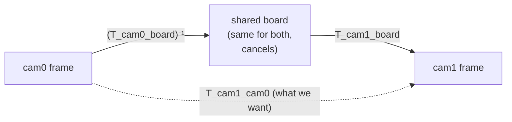
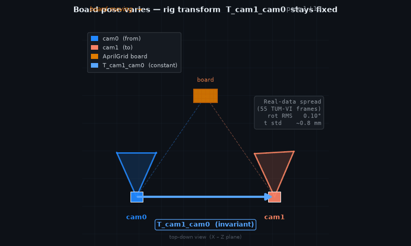

# Stereo extrinsics — recovering a rig's camera-to-camera transform

> **Run alongside this:** `python examples/06_stereo_extrinsics_tumvi.py --stride 8`
> (after the [setup](README.md#setup-once)). Read this, then read the printed numbers.

**On this page**
- §1: Run the example and interpret the results
- §2: Understand why a shared board cancels the unknown motion
- §3–5: Code your way through per-frame poses, alignment, and averaging
- §6: Score against the reference and learn the rotation/translation scale trade-off

The [capstone](capstone_calibrating_a_real_camera.md) recovered one camera's *intrinsics* —
the numbers that map a 3D ray to a pixel. A stereo rig adds a second number that matters as
much: the **extrinsic**, the rigid transform `T_cam1_cam0` that places one camera relative to
the other. Every depth-from-stereo and visual-inertial pipeline needs it.

You recover that transform here from TUM-VI's real, hardware-synced fisheye footage and check
it against the dataset authors' published value — landing **rotation to 0.06°** and **baseline
within ~0.2%**. The whole method rests on one cancellation, which §2 shows you.

**You'll learn**
- The mental model: why two synced cameras watching the *same* board hand you their relative
  pose for free, even though the board is moving and its pose is unknown.
- How to turn per-frame board poses into a single rig transform with
  [`estimate_relative_pose`](../../ds_msp/calib/stereo.py).
- How to score the result against a published reference with `relative_pose_error`, and what
  "rotation is scale-free, translation is not" means in practice.

**Prerequisites**
- Finish [Chapter 2](02_double_sphere_model.md) and skim the
  [capstone](capstone_calibrating_a_real_camera.md) — this chapter reuses its per-camera
  calibration step and assumes you've seen AprilGrid detection.
- The `[calib]` install and the TUM-VI calib data:
  ```bash
  uv pip install -e ".[calib]"
  bash scripts/download_datasets.sh tumvi
  ```

> **Scope.** This is the *calibration* `estimate_relative_pose` — it averages per-frame board
> poses into a rig transform. There is a second function with the same name in `ds_msp.mvg`
> that recovers pose from raw feature matches (the essential matrix on bearing vectors); that
> is [Chapter 8](README.md#part-ii--geometry--3d)'s topic. This chapter anchors only to
> `ds_msp.calib`.

## 1. The minimal working example

Run the companion script. It detects the board in both cameras, calibrates each, composes the
extrinsic, and compares to the reference — the whole pipeline in one command:

```bash
python examples/06_stereo_extrinsics_tumvi.py --stride 8
```

Expected output:
```
Detecting AprilGrid in 55 synced stereo pairs ...
  55 frames with >=6 tags in both cameras
Calibrating each camera ...
  cam0 fx,fy,cx,cy = [190.99 190.98 254.96 256.84]
  cam1 fx,fy,cx,cy = [190.4  190.37 252.64 254.98]

Stereo extrinsics  T_cam1_cam0  (from 55 frames)
  mine       baseline  101.27 mm   t = [-101.25   -1.93   -1.03]
  published  baseline  101.09 mm   t = [-101.06   -1.98   -1.18]

  rotation error      : 0.062 deg
  translation error   : 0.25 mm
  per-frame spread     : rot RMS 0.10 deg, t std [0.8 0.8 0.7] mm
```

That last block is the result. Starting from raw footage, the recovered `T_cam1_cam0` matches
the published reference to **0.062° in rotation** and **0.25 mm in translation** (baseline
101.27 mm vs 101.09 mm — about 0.2% off). The rest of the chapter walks you through how those
numbers appear, one step at a time.

> **Note** `--stride 8` keeps every 8th synced pair (55 frames here) so the per-camera bundle
> adjustment finishes in well under a minute. A smaller stride uses more frames and shifts the
> numbers slightly; the values above are the `--stride 8` run. If you quote a number, quote the
> stride that produced it.

## 2. The mental model: the shared board cancels out

One insight carries the whole chapter: a shared board lets the rig transform fall out for free.
Both cameras are **hardware-synced**, so at each timestamp `i` they photograph the board in the
*exact same position*. Calibrating each camera gives you, per frame, the board's pose in that
camera's coordinate frame:

- `T_cam0_board[i]` — where the board sits, seen from cam0.
- `T_cam1_board[i]` — the same physical board, seen from cam1.

The board's pose is *unknown and different every frame* (someone is waving it around). But the
two cameras are bolted together, so the transform *between* them never changes. Compose one
board pose with the inverse of the other and the moving board cancels:

```
T_cam1_cam0  =  T_cam1_board[i]  ∘  (T_cam0_board[i])⁻¹
```

Read it right to left: take a point in cam0's frame, go *back* to the board, then *forward*
into cam1. The board is the bridge. Because both cameras saw the *same* board at frame `i`, that
bridge is identical on both sides and drops out, leaving the fixed rig transform.



Every frame gives one estimate of `T_cam1_cam0`. With 55 frames you get 55 estimates of the
same fixed quantity — so you **average** them, and the spread across frames tells you how much
to trust the result. That averaging is the next step.


*Two cameras (blue = cam0, orange = cam1) are bolted in place. An AprilGrid board moves to ten
different positions and orientations across the loop. Each frame independently recovers
`T_cam1_cam0 = T_cam1_board ∘ (T_cam0_board)⁻¹` via `estimate_relative_pose`; the rig arrow
between cam0 and cam1 stays pinned while the board sweeps — the invariance that lets the unknown
board pose cancel. On real TUM-VI footage (55 frames, `--stride 8`) the per-frame rotation spread
is **rot RMS 0.10°** and translation spread **~0.8 mm**, confirming the rig transform is
effectively constant across frames. (Top-down X–Z view; board poses computed from real `ds_msp`
geometry; lie factor = 1.000.)*

## 3. Get the per-frame board poses

`estimate_relative_pose` needs the board pose, per frame, from *each* camera. Those come
straight out of the per-camera calibration: `calibrate` returns a `"poses"` list alongside the
intrinsics. The example wraps this in `calibrate_camera`:

> The snippets below continue from this setup:
> ```python
> import os, glob
> import numpy as np
> from ds_msp.calib import (AprilGridTarget, calibrate, detect_aprilgrid,
>                           estimate_relative_pose, relative_pose_error)
> from ds_msp.io import load_kalibr_extrinsics
> from ds_msp.models import KannalaBrandtModel
>
> SEQ = "datasets/tumvi/dataset-calib-cam1_512_16/mav0"
> CAMCHAIN = "datasets/tumvi/dataset-calib-cam1_512_16/dso/camchain.yaml"
> target = AprilGridTarget(tag_rows=6, tag_cols=6, tag_size=0.088, tag_spacing=0.3)
> ```

```python
def calibrate_camera(detections, target):
    """One camera -> (intrinsics, per-frame board poses)."""
    Xs, UVs, VIs = target.build_correspondences(detections, min_corners=8)
    seed = KannalaBrandtModel(fx=190, fy=190, cx=256, cy=256)   # rough fisheye guess
    out = calibrate(seed, Xs, UVs, VIs, max_nfev=120, loss="cauchy", f_scale=0.5)
    return out["model"], out["poses"]   # poses[i] = (rvec(3,), tvec(3,)) board->cam, metres
```

Each entry of `poses` is a `(rvec, tvec)` pair: a Rodrigues rotation vector and a translation
in metres, encoding `T_camN_board` for that frame. That `(rvec, tvec)` tuple is exactly the
`Pose` type `estimate_relative_pose` expects.

Notice that each `tvec` points from the board origin to the camera, expressed in the camera's
frame — not from the camera to the board. Get this direction backwards and the §2 cancellation
composes the wrong way.

> **Note** The translation unit is metres because the board's metric size is set by
> `tag_size=0.088` (88 mm tags). Hold that thought — it's why §6's translation is only as
> accurate as that 88 mm assumption, while the rotation needs no scale at all.

## 4. Frame alignment: same index, same timestamp

`estimate_relative_pose(poses_from, poses_to)` assumes `poses_from[i]` and `poses_to[i]` are
the **same frame** seen by the two cameras. Keep that alignment airtight. Mix in board poses
from *different* moments and the §2 cancellation breaks.

TUM-VI makes alignment easy: cam0 and cam1 store synced frames under the *same filename* (the
timestamp). The example builds matched path lists, then keeps only frames where *both* cameras
detected enough of the board:

```python
names = sorted(os.path.basename(p) for p in
               glob.glob(os.path.join(SEQ, "cam0", "data", "*.png")))[::8]   # stride 8
cam0_paths = [os.path.join(SEQ, "cam0", "data", n) for n in names]
cam1_paths = [os.path.join(SEQ, "cam1", "data", n) for n in names]

det0 = detect_aprilgrid(cam0_paths, family="t36h11", min_tags=0, refine=True)
det1 = detect_aprilgrid(cam1_paths, family="t36h11", min_tags=0, refine=True)
keep = [i for i in range(len(names)) if len(det0[i]) >= 6 and len(det1[i]) >= 6]
det0 = [det0[i] for i in keep]
det1 = [det1[i] for i in keep]
print(f"{len(keep)} frames with >=6 tags in both cameras")   # -> 55 frames with >=6 tags in both cameras
```

The `keep` filter is the load-bearing line: it drops any frame one camera saw poorly, so the
two pose lists stay index-aligned. After it, `poses0[i]` and `poses1[i]` are guaranteed to be
the same physical board pose.

## 5. Compose and average into one rig transform

Hand the two aligned pose lists to `estimate_relative_pose`. Pass cam0 first and cam1 second to
get `T_cam1_cam0` (Kalibr's `T_cn_cnm1` for cam1 — "this camera from the previous one"):

```python
cam0, poses0 = calibrate_camera(det0, target)
cam1, poses1 = calibrate_camera(det1, target)

rig = estimate_relative_pose(poses0, poses1)   # poses_from=cam0, poses_to=cam1
print(rig["n"])                                # -> 55  (frames averaged)
print(np.round(rig["t"] * 1000, 2))            # -> [-101.25  -1.93  -1.03]  (mm)
print(f"{rig['rot_rms_deg']:.2f}")             # -> 0.10  per-frame rotation spread, deg
```

Under the hood it does exactly §2, then averages robustly across frames:

- **Rotation** — it averages the 55 rotation matrices element-wise, then projects the result
  back onto a valid rotation with an SVD (`R = U Vᵀ`). Averaging matrices then re-orthonormalizing
  is the standard chordal mean on SO(3); a plain element-wise average isn't a rotation, the SVD
  fixes that.
- **Translation** — it takes the **component-wise median** of the 55 translation vectors, which
  shrugs off the occasional bad-PnP frame far better than a mean.

The returned dict also reports the spread: `rot_rms_deg` (0.10°) and `t_std_mm`
(`[0.8 0.8 0.7]` mm). These are *consistency* numbers — how much the per-frame estimates
disagree among themselves. A small spread means the 55 frames tell the same story. That is your
first signal the answer is trustworthy, *before* you ever look at the reference.

## 6. Score it against the published reference

The payoff: compare the recovered transform to the value TUM-VI's authors published. Load their
extrinsic from the camchain and diff the two transforms with `relative_pose_error`:

```python
published = load_kalibr_extrinsics(CAMCHAIN, cam="cam1")   # 4x4 T_cn_cnm1 = T_cam1_cam0
err = relative_pose_error(rig["T"], published)
print(round(err["rot_deg"], 3))    # -> 0.062   rotation angle between the two, deg
print(round(err["trans_mm"], 2))   # -> 0.25    translation difference, mm

print(round(np.linalg.norm(rig["t"]) * 1000, 2))            # -> 101.27  my baseline, mm
print(round(np.linalg.norm(published[:3, 3]) * 1000, 2))    # -> 101.09  published baseline, mm
```

Expected output:
```
0.062
0.25
101.27
101.09
```

`relative_pose_error` returns two numbers: `rot_deg`, the geodesic angle between the two
rotations (how far you'd have to rotate one to match the other), and `trans_mm`, the Euclidean
distance between the two translation vectors. **0.062° and 0.25 mm** — recovered from raw
footage, matching a published reference to a sixteenth of a degree.

The critical scale subtlety — the one thing readers get wrong — is this:

| Quantity | Source | Why it matters |
|---|---|---|
| **Rotation (0.062°)** | Comes from *directions* only; never needs metric size. | Unconditional. It would hold even if you'd guessed the tag size wrong by 10%. |
| **Translation (0.25 mm / ~0.2%)** | Carries the scale you assumed (`tag_size=0.088`). Get that wrong by 1% and every distance scales by 1%. | Proof that 88 mm is the right tag size *and* a proxy for overall measurement fidelity. |

This is why the example phrases the result as "rotation to a fifth of a degree, baseline to ~1%": the two numbers are trustworthy for *different* reasons and speak to different kinds of error.

## Recap

You recovered a stereo rig's extrinsic transform from real footage and proved it against a
published reference. Here is what you achieved:

| Quantity | Recovered (`--stride 8`) | Published | Agreement |
|---|---|---|---|
| Rotation | — | — | **0.062°** error |
| Baseline | 101.27 mm | 101.09 mm | **0.25 mm** (~0.2%) |
| Per-frame spread | rot RMS 0.10°, t std ~0.8 mm | — | self-consistency |

The mechanism, in one line: **synced cameras share the board, so per frame
`T_cam1_cam0 = T_cam1_board ∘ (T_cam0_board)⁻¹`** — the moving board cancels, and you robustly
average the per-frame estimates (chordal mean for rotation, median for translation). Rotation
is scale-free; translation inherits the assumed 88 mm tag size.

## Try it yourself

Deepen your understanding by modifying the code. Each of the following exercises isolates one part of the method:

1. **Swap the argument order.** Call `estimate_relative_pose(poses1, poses0)` instead. Predict
   the baseline sign before you run: you've asked for `T_cam0_cam1`, the *inverse* rig
   transform. Does `rot_deg` against `published` change? (It should jump — you're now comparing
   inverse to forward.)
2. **Break the scale on purpose.** Re-run with `tag_size=0.066` in the `AprilGridTarget`.
   Predict what happens to `rot_deg` vs `trans_mm`. (Rotation: unchanged. Baseline: scaled by
   66/88, so the translation error blows up while rotation stays put — the §6 lesson, measured.)
   If you followed the snippets rather than the full script, redefine `target` with the new
   `tag_size` and re-call `calibrate_camera` on both cameras before re-running §5.
3. **Use more frames.** Drop `--stride` to 4. Does the per-frame spread (`rot_rms_deg`) shrink,
   and does the agreement with the reference improve? More frames usually tighten the average.

## Next steps

- **Use the extrinsic for depth.** With `T_cam1_cam0` in hand, the two cameras define their
  epipolar geometry — the constraint that fixes where a point in one image can land in the
  other. That constraint is the basis for stereo depth. See **Part II → [Sphere-sweep stereo
  depth](README.md#part-ii--geometry--3d)**, which gets dense depth straight on raw fisheye.
- **Recover pose without a board.** This chapter leaned on a known calibration target. The
  `ds_msp.mvg` two-view geometry recovers relative pose from *feature matches alone* — the
  essential matrix on bearing vectors. See **Part II → [Two-view geometry on
  rays](README.md#part-ii--geometry--3d)**.
- **Reference:** the two functions used here live in
  [`ds_msp/calib/stereo.py`](../../ds_msp/calib/stereo.py); the camchain I/O in
  [`ds_msp/io/kalibr.py`](../../ds_msp/io/kalibr.py).
